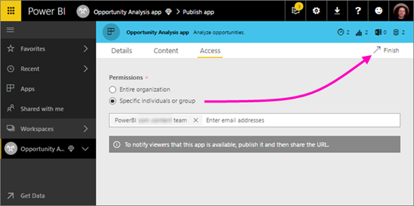
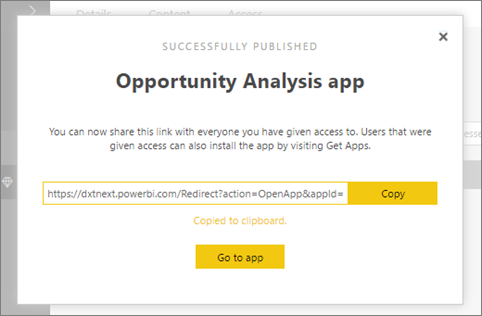
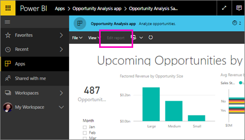
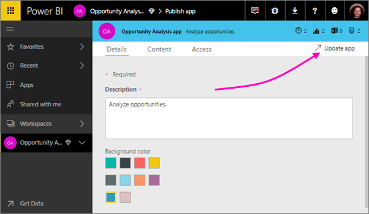

<properties 
   pageTitle="Create and distribute an app in Power BI"
   description="Apps are a collection of dashboards and reports purpose-built by your organization to deliver key metrics for faster data-driven decisions."
   services="powerbi" 
   documentationCenter="" 
   authors="maggiesMSFT" 
   manager="erikre" 
   editor=""
   tags=""
   qualityFocus="no"
   qualityDate=""/>
 
<tags
   ms.service="powerbi"
   ms.devlang="NA"
   ms.topic="article"
   ms.tgt_pltfrm="NA"
   ms.workload="powerbi"
   ms.date="04/28/2017"
   ms.author="maggies"/>

# Create and distribute an app in Power BI

## What are Power BI apps?
Apps are collections of dashboards and reports purpose-built by your organization to deliver key metrics for faster and easier data-driven decisions. 

Business users often need multiple Power BI dashboards and reports to run their business. For example, sales managers might need a dashboard to monitor the leads funnel, another to monitor sales leaderboards, and yet another to monitor and analyze sales forecasts. They have to try to remember the names of all these dashboards and how to navigate to them.

For you as a report creator or admin, managing permissions on individual dashboards can be time-consuming and error prone. 

With Power BI apps, now in preview, you can deploy and manage collections of purpose-built dashboards and reports to a large number of business users. You can distribute these apps to the whole organization or to specific people or groups. 

Business users can install these apps from Microsoft AppSource, or you can send them a direct link. They can easily find and return to your content because it’s all in one place. They get updates automatically and you can control how frequently the data refreshes. Read more about the [app experience for business users](powerbi-service-what-are-apps.md).

### Licensing

You need a Power BI Pro license to distribute apps, and business users need Power BI Pro licenses to view them. However, with the upcoming Premium licensing, if the app workspace resides in Power BI Premium capacity, then business users can access the content without a Power BI Pro license. Read more about Power BI Premium. 

### Apps and organizational content packs

Apps are the evolution of organizational content packs. If you have organizational content packs already, they'll continue to work side by side with apps.

Now that you have an overview of apps, let’s talk about *app workspaces*, where you create apps. 

## App Workspaces 

*App workspaces* are the places where you create apps, so to create an app, you first need to create the app workspace. If you’ve ever worked in a group workspaces in Power BI, then app workspaces will be familiar. They’re the evolution of group workspaces – staging areas and containers for the content in the app. 

You can add other collaborators to these workspaces as members or admins. You and your colleagues can collaborate on dashboards, reports, and other articles that you plan to distribute to a wider audience, or even your entire organization. 

When the content is ready, you distribute the app. You can send a direct link to  that wider audience, or they can find your app in AppSource by going to Get Data. Those people can’t modify the contents of the app, but they can interact with it either in the Power BI service, or one of the mobile apps -– filtering, highlighting, and sorting the data themselves. 

### How are app workspaces different from group workspaces? 

All existing group workspaces can serve as app workspaces, and you can publish apps from any of these workspaces. Here’s one way app workspaces and group workspaces are different: You create an app workspace as a place to create and house a specific app. There’s a one-to-one relationship between the app and contents of the app workspace. Everything in the app workspace will be in the app when you distribute it. 

Now that you understand apps and app workspaces, let's start creating and publishing an app. 

## Create an app in an app workspace

1. Start by creating the workspace. Select **Workspaces** > **Create a workspace**.

     

    This will be the place to put content that you and your colleagues collaborate on.

2. Give the workspace a name. If the corresponding **Workspace ID** isn't available, edit it to come up with a unique ID.

     

3. You have a few options to set. If you choose **Public**, anyone in your organization can see what’s in the workspace. **Private**, on the other hand, means only members of the workspace can see its contents.

     

    > [AZURE.NOTE]  You can't change the Public/Private setting after you've created the group.

4. You can also choose if members can **edit** or have **view-only** access.

     

    You can change the edit/view-only setting later, after you've created the group. 

5. Add email addresses of people you want to have access to the workspace, and select **Add**. You can’t add group aliases, just individuals.

6. Decide whether each person is a member or an admin.

     

    Admins can edit the workspace itself, including adding other members. Members can edit the content in the workspace, unless they have view-only access. Both can publish the app.

7. Select **Save**.

Power BI creates the workspace and opens it. It appears in the list of workspaces you’re a member of. Because you’re an admin, you can select the ellipsis (…) to go back and make changes to it, adding new members or changing their permissions.

It’s empty, so now you add content to it. Adding content is just like adding content to your My Workspace, except the other people in the workspace can see and work on it, too. Another difference is that when you get done, you can distribute the content as an app. While in the app workspace, you can upload or connect to files, or connect to third-party services, just as you would in your own My Workspace. For example:

- [Connect to services](powerbi-content-packs-services.md) such as Microsoft Dynamics CRM, Salesforce, or Google Analytics.

- [Get data from files](powerbi-service-get-data-from-files.md) such as Excel, CSV, or Power BI Desktop (PBIX) files.

## Add an image to your app (optional)

By default, Power BI creates a little colored circle for your app, with the app's initials. But maybe you want to customize it with an image.

1. Select **Workspaces**, select the ellipsis (...) next to the name of the workspace, then **Members**. 

     

    The Office 365 Outlook account for the workspace opens in a new browser window.

2. When you hover over the colored circle in the upper left, it turns into a pencil icon. Select it.

     

3. Select the pencil icon again, and find the image you want to use.

     

4. Select **Save**.

     

    The image replaces the colored circle in the Office 365 Outlook window. 

     

    In a few minutes, it will appear in the app in Power BI, too.

     

## Distribute an app
When you’ve finished creating and perfecting the dashboards and reports in your app workspace, you package it all up as an app and distribute it.

1. In the workspace, select the **Publish app** button in the upper right to start the process of sharing all the content in that workspace.

     

2. First, on **Details**, fill in the description to help people find the app. You can set a background color to personalize it.

     

3. Next, on **Content**, you see the content that’s going to be published as part of the app – everything that’s in that workspace. You can also set the landing page – the dashboard or report people will see first when they go to your app. You can choose **None**. Then they’ll land on a list of all the content in the app. 

     

4. Last, on **Access**, decide who has access to the app: either everyone in your organization, or specific people or email distribution lists. 

     

5. When you select **Finish**, you see a message confirming it’s ready to publish.
6. In the success dialog box, you can copy the URL that’s a direct link to this app and send it to the people you’ve shared it with.

     

The business users that you've distributed the app to can find it in two different ways. You can send them the direct link to the app, or they can search for it in AppSource, where they see all the apps that they can access. Either way, after that whenever they go to Apps, they’ll see this app in their list.

Read more about the [app experience for business users](powerbi-service-what-are-apps.md).

## Change your published app
After you publish your app, you may want to change or update it. You notice that when you open your app from Apps, even though you’re the one who published it, you can’t edit it – **Edit Report** is grayed out. 

 
But it’s easy to update it if you’re an admin of the app workspace, or member with editing permissions. 

1. Open the workspace where you created the app. 

     

2. Open the dashboard or the report. You see that you can make any changes you want.
3. Go back to the app workspace list of contents and select **Publish app**.

     

4. Update **Details**, **Content**, and **Access**, if you need to, then select **Update app**.

     

The people you’ve distributed the app to will automatically see the updated version of the app. 

## Next steps
- [What are apps in Power BI?](powerbi-service-what-are-apps.md)
- Questions? [Try asking the Power BI Community](http://community.powerbi.com/)
