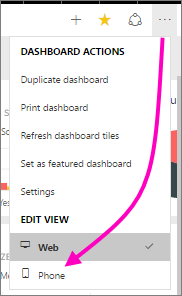
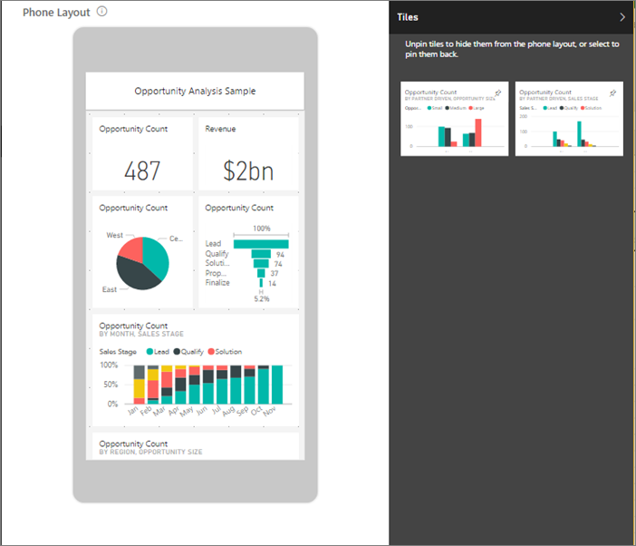
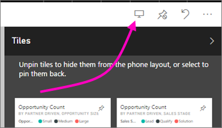

<properties
   pageTitle="Create a view of a dashboard optimized for mobile phones"
   description="Learn how to create a customized view of a dashboard in the Power BI service specifically for viewing on mobile phones."
   services="powerbi"
   documentationCenter=""
   authors="maggiesMSFT"
   manager="erikre"
   backup=""
   editor=""
   tags=""
   qualityFocus="no"
   qualityDate=""/>

<tags
   ms.service="powerbi"
   ms.devlang="NA"
   ms.topic="article"
   ms.tgt_pltfrm="NA"
   ms.workload="powerbi"
   ms.date="02/06/2017"
   ms.author="maggies"/>

# Create a view of a dashboard optimized for mobile phones

When you view dashboards in the Power BI mobile app on a phone, you notice the dashboard tiles are laid out one after another, all the same size. In the Power BI service, you can create a customized view of any dashboard that you own, specifically for phones.

When you turn the phone sideways, then you see the dashboard as it's laid out in the service, not as you designed it for the phone.

> **Note**: As you edit the phone view, anyone viewing the dashboard on a phone can see the changes you make in real time. 
> 
> For example, if you unpin all tiles on the dashboard phone view, the dashboard on the phone will suddenly have no tiles. 

1. In the Power BI service, open a dashboard.

2. Select the ellipsis (...) in the upper-right corner > under **Edit View**, select **Phone**.

    

    >**Note**: If you aren't the dashboard owner, you won't see this option on the menu.

    

    The phone dashboard edit view opens. Here you can unpin, resize, and rearrange tiles to fit the phone view. The web version of the dashboard doesn't change.

3. Select a tile to drag, resize, or unpin it. You notice the other tiles move out of the way as you drag a tile.

    

    The unpinned tiles go in the Tiles pane, where they stay unless you add them back.

    

4. If you change your mind, select **Reset phone view**  to put them back in the size and order they were before.

    

    >**Note**: Just opening Phone Edit view in the Power BI service slightly changes the size and shape of the tiles on a phone. So to return the dashboard to its exact state before you opened it in Phone Edit view, select **Reset phone view**.

5. When you're satisfied with the phone dashboard layout, select the ellipsis (...) in the upper-right corner and under **Edit View**, select **Web**.

    Power BI saves the phone layout automatically.

## See also

- [Get started with Power BI](powerbi-service-get-started.md)
- [Dashboards in the Power BI mobile apps](powerbi-mobile-create-dashboard.md)
- More questions? [Try asking the Power BI Community](http://community.powerbi.com/)