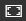

<properties
   pageTitle="Display dashboards and reports in Full Screen mode (TV mode)"
   description="Display dashboards and reports in TV mode, aka Full Screen Mode."
   services="powerbi"
   documentationCenter=""
   authors="mihart"
   manager="mblythe"
   backup=""
   editor=""
   tags=""
   featuredVideoId="c31gZkyvC54"
   qualityFocus="identified"
   qualityDate=""/>

<tags
   ms.service="powerbi"
   ms.devlang="NA"
   ms.topic="article"
   ms.tgt_pltfrm="NA"
   ms.workload="powerbi"
   ms.date="10/07/2016"
   ms.author="mihart"/>

# Display dashboards and reports in Full Screen mode (TV mode)

## What is Full Screen mode?

Display your dashboards, reports, tiles, and visuals without the distraction of menus and navigation buttons.  You get an unadulterated, full view of your business at a glance, all the time. This is sometimes referred to as TV Mode.

Some uses for Full Screen mode are:

- presenting your dashboard, tile, visual, or report at a meeting or conference
- displaying in an office on a dedicated large screen or projector
- viewing on a small screen
- reviewing in locked mode -- you can touch the screen or mouse over tiles without opening the underlying report or dashboard

>**NOTE**:
>Full Screen mode is different than [Focus (Pop out) mode](powerbi-service-display-dash-in-focus-mode.md).

Watch Amanda open and navigate her dashboard in fullscreen mode and then apply some URL parameters to control the default display. Then follow the step-by-step instructions below the video to try it out yourself.

<iframe width="560" height="315" src="https://www.youtube.com/embed/c31gZkyvC54" frameborder="0" allowfullscreen></iframe>

## To turn Full Screen mode on (and off) for a dashboard or report

1. From the Power BI menu bar above your dashboard or report, select the **Full Screen** icon.

      

2. Your dashboard or report page fills the entire screen.

      

3. Use the **Back** button to navigate to the previous page in your browser. If the previous page was a Power BI service page, it will display in Full Screen mode.  Full Screen mode will persist until you close Full Screen.

3. To exit Full Screen mode, select the **Close Full Screen** icon.

      

## To turn Full Screen mode on (and off) for a dashboard tile or report visual

1. While in Full Screen mode for a report or a dashboard, select the Focus mode icon   for a specific tile or specific visual. The tile or visual will display full screen without menus or chrome.

    

2. To exit, hover to reveal the options menu and select the Exit icon to return to the dashboard (for tiles) or to the report (for visuals).

    

## Dashboards in Full Screen mode

### Fit to screen
Full Screen mode for dashboards offers some display options that are not available for reports.

Sometimes dashboards will display in Full Screen mode with scrollbars (see above). To remove scrollbars, move your cursor to an empty area on your screen to reveal the Full Screen options menu.  

  And select the **Fit to screen** icon.
    

### Fit to width
And sometimes you don't care about scrollbars, but want the dashboard or report to fill the entire width of the available space.  Select the **Fit to width** icon. 

### Printing
To print a dashboard from Full Screen mode, select the Print icon.

## Reports in Full Screen mode
### Display report pages
Full Screen reports don't have the option to print or the options for **Fit to screen** or **Fit to width**.  However, when a report is in Full Screen mode, you can use the forward and reverse arrows to move through the report pages.

  .

## See also  
[Dashboards in Power BI](powerbi-service-dashboards.md)  
[Power BI - Basic Concepts](powerbi-service-basic-concepts.md)
More questions? [Try the Power BI Community](http://community.powerbi.com/)
