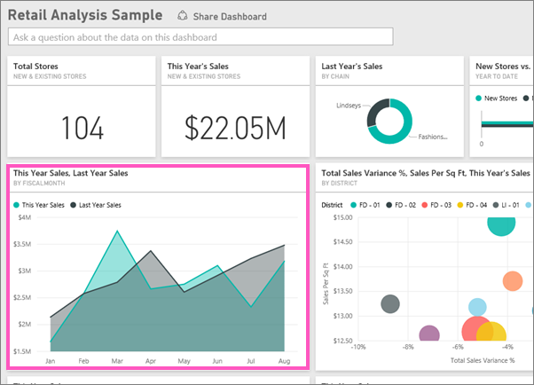
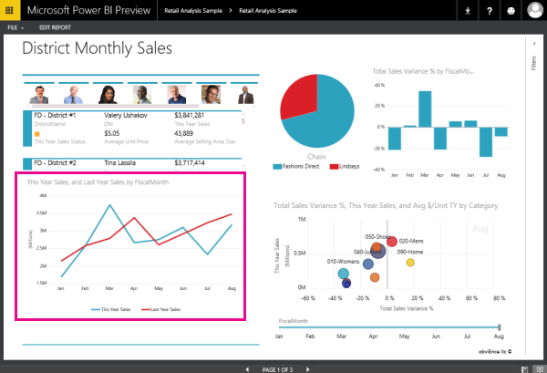
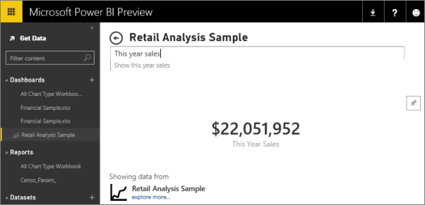

<properties pageTitle="Dashboard tiles in Power BI" description="Dashboard tiles in Power BI" services="powerbi" documentationCenter="" authors="v-anpasi" manager="mblythe" editor=""/>
<tags ms.service="powerbi" ms.devlang="NA" ms.topic="article" ms.tgt_pltfrm="NA" ms.workload="powerbi" ms.date="06/26/2015" ms.author="v-anpasi"/>
# Dashboard tiles in Power BI

[← All about dashboards](https://support.powerbi.com/knowledgebase/topics/65158-all-about-dashboards)

A tile is a snapshot of your data, pinned to the dashboard. A tile can be created from a report, from a dataset, or from the Q&A box.

Need help understanding the building blocks that make up Power BI?  See [Power BI - Basic Concepts](http://support.powerbi.com/knowledgebase/articles/487029-power-bi-preview-basic-concepts).

-   [Pin a tile to a dashboard from the Q&A question box](https://support.powerbi.com/knowledgebase/articles/424874-pin-a-tile-to-a-power-bi-dashboard-from-the-q-a-qu)
-   [Pin a tile to a dashboard from a report](https://support.powerbi.com/knowledgebase/articles/430323-pin-a-tile-to-a-power-bi-dashboard-from-a-report)

## What happens when I click a dashboard tile?

When you click a tile, what happens next depends on how the tile was created. If you created the tile from:

-   [a report](https://support.powerbi.com/knowledgebase/articles/425669#report): you go to a page in the report (in [Reading View](http://support.powerbi.com/knowledgebase/articles/445094-interact-with-a-report-in-reading-view)).
-   [Power BI Q&A](https://support.powerbi.com/knowledgebase/articles/425669#qna): you go to the Q&A box with the tile and associated query active.
-   [a dataset](https://support.powerbi.com/knowledgebase/articles/425669#dataset): if you saved the report in which you created the visualization, you go to a page in the report. If not, then clicking the tile produces no action.

## If the tile was created in a Power BI report

In the dashboard, click the tile. 

 

The report opens.  If the report has more than one page, you are taken to the page that contains the visualization that was used to create the tile.

NOTE:  If the original visualization used to create the tile changes, the tile doesn't change.  For example, if you pinned a line chart from a report and then you change the line chart to a bar chart, the dashboard tile continues to show a line chart. 

[Back to top](http://support.powerbi.com/knowledgebase/articles/425669-when-you-click-a-tile-in-a-dashboard)

## If the tile was created with Q&A

In the dashboard, click the tile.

Q&A opens with the question that was used to create the visualization, displaying the visualization.

[Back to top](http://support.powerbi.com/knowledgebase/articles/425669-when-you-click-a-tile-in-a-dashboard)

## See Also

[Dashboards in Power BI](http://support.powerbi.com/knowledgebase/articles/424868-dashboards-in-power-bi)  
[Power BI - Basic Concepts](http://support.powerbi.com/knowledgebase/articles/487029-power-bi-preview-basic-concepts)
