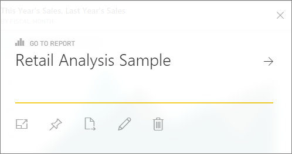

<properties
   pageTitle="Dashboard tiles in Power BI"
   description="All about dashboard tiles in Power BI"
   services="powerbi"
   documentationCenter=""
   authors="mihart"
   manager="mblythe"
   editor=""
   tags=""
   qualityFocus="complete"
   qualityDate="03/15/2016"/>

<tags
   ms.service="powerbi"
   ms.devlang="NA"
   ms.topic="article"
   ms.tgt_pltfrm="NA"
   ms.workload="powerbi"
   ms.date="03/05/2016"  
   ms.author="mihart"/>

# Dashboard tiles in Power BI
## Dashboard tiles

A tile is a snapshot of your data, pinned to the dashboard. A tile can be created from a report, dataset, dashboard, from the Q&A box, Excel, and from SQL Server Reporting Services (SSRS), and more.  The screenshot below shows many different tiles pinned to a dashboard.

Besides pinning, standalone tiles can be created directly on the dashboard using [Add widget](powerbi-service-add-a-widget-to-a-dashboard.md). Standalone tiles include: text boxes, images, videos, and web content.

Need help understanding the building blocks that make up Power BI?  See [Power BI - Basic Concepts](powerbi-service-basic-concepts.md).

>**Note**  
>If the original visualization used to create the tile changes, the tile doesn't change.  For example, if you pinned a line chart from a report and then you change the line chart to a bar chart, the dashboard tile continues to show a line chart. The data refreshes, but the visualization type does not.

## Pin a tile from...

Tiles can be pinned from:

-   [Power BI Q&A](powerbi-service-pin-a-tile-to-a-dashboard-from-the-question-box.md)

-   [a report](powerbi-service-pin-a-tile-to-a-dashboard-from-a-report.md)

-   [another dashboard](powerbi-pin-a-tile-from-one-dashboard-to-another.md)

- [Excel workbook on OneDrive for Business](powerbi-service-pin-a-tile-to-a-dashboard-from-excel.md)

- [Quick Insights](powerbi-service-auto-insights.md)

-   [SSRS](https://msdn.microsoft.com/library/mt604784.aspx)

And standalone tiles for images, text boxes, videos, and web content can be created directly on the dashboard using [Add widget](powerbi-service-add-a-widget-to-a-dashboard.md).

  

## Interacting with tiles on a dashboard

### Move and resize a tile

Grab a tile and [move it around on the dashboard](powerbi-service-edit-a-tile-in-a-dashboard.md). Hover and select the handle  to resize the tile.

### Hover over a tile to change the appearance and behavior

1. Hover over the tile to display the ellipses.

    
2. Select the ellipses to open the tile action menu.

    
From here you can:

- [Edit title and subtitle, add a hyperlink, display last refresh time](powerbi-service-edit-a-tile-in-a-dashboard.md) 
- [Export the data used in the tile](powerbi-service-edit-a-tile-in-a-dashboard.md)

- [View in full screen Focus  mode](powerbi-service-edit-a-tile-in-a-dashboard.md) 

- [Pin the tile to another dashboard](powerbi-pin-a-tile-from-one-dashboard-to-another.md)
 

- [Remove the tile](powerbi-service-edit-a-tile-in-a-dashboard.md)
 

3. To close the action menu, select the X icon .

### Select (click) a tile
When you select a tile, what happens next depends on how the tile was created and if it has a [custom link](powerbi-service-edit-a-tile-in-a-dashboard.md). If it has a custom link, selecting the tile takes you to that link. Otherwise, selecting the tile takes you to the report, Excel Online workbook, SSRS report manager page, or Q&A question that was used to create the tile.

>**NOTE**: The exception to this is video tiles created using **Add widget**. Selecting a video widget tile causes the video to play right there on the dashboard.   

## Tips and troubleshooting  

- If the report that was used to create the visualization was not saved, then selecting the tile produces no action.

- If the tile was created from a workbook in Excel Online, and you do not have at least Read permissions for that workbook, selecting the tile will not open the workbook in Excel Online.

- For tiles created from **Add widget**, if a custom hyperlink has been set, selecting the title, subtitle, and or tile will open that URL.  Otherwise, by default, selecting a widget tile for an image, web code, or text box produces no action.

- If you don't have permissions, selecting a tile created from SSRS produces no action. Otherwise, the [SSRS report manager page opens](https://msdn.microsoft.com/library/mt604784.aspx).

- If the original visualization used to create the tile changes, the tile doesn't change.  For example, if you pinned a line chart from a report and then you change the line chart to a bar chart, the dashboard tile continues to show a line chart. The data refreshes, but the visualization type does not.

## See also  
[Create a big number tile from a report](powerbi-service-create-a-big-number-tile-from-a-power-bi-report.md)

[Create a big number tile from Q&A](powerbi-service-create-a-big-number-tile-for-a-dashboard.md)

[Dashboards in Power BI](powerbi-service-dashboards.md)  
[Data refresh](powerbi-refresh-data.md)

[Power BI - Basic Concepts](powerbi-service-basic-concepts.md) 
 
[Export a tile to Power Point](http://blogs.msdn.com/b/powerbidev/archive/2015/09/28/integrating-power-bi-tiles-into-office-documents.aspx)
