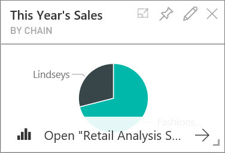
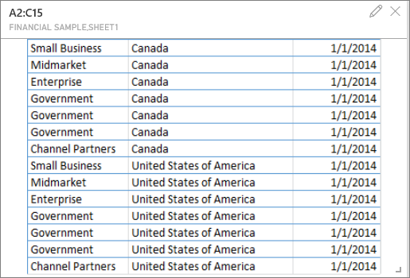

<properties
   pageTitle="Dashboard tiles in Power BI"
   description="All about dashboard tiles in Power BI"
   services="powerbi"
   documentationCenter=""
   authors="mihart"
   manager="mblythe"
   editor=""
   tags=""/>

<tags
   ms.service="powerbi"
   ms.devlang="NA"
   ms.topic="article"
   ms.tgt_pltfrm="NA"
   ms.workload="powerbi"
   ms.date="10/16/2015"
   ms.author="mihart"/>

# Dashboard tiles in Power BI  

A tile is a snapshot of your data, pinned to the dashboard. A tile can be created from a report, dataset, dashboard, from the Q&A box, Excel, and from SQL Server Reporting Services (SSRS).  

Need help understanding the building blocks that make up Power BI?  See [Power BI - Basic Concepts](powerbi-service-basic-concepts.md).

## How do I create a tile?

-   [Pin a tile to a dashboard from the Q&A question box](powerbi-service-pin-a-tile-to-a-dashboard-from-the-question-box.md)

-   [Pin a tile to a dashboard from a report](powerbi-service-pin-a-tile-to-a-dashboard-from-a-report.md)

-   [Pin a tile to a dashboard from another dashboard](powerbi-pin-a-tile-from-one-dashboard-to-another.md)

- [Pin a tile to a dashboard from an  Excel workbook on OneDrive for Business](powerbi-service-pin-a-tile-to-a-dashboard-from-excel.md)

-   [Pin a tile to a dashboard from SSRS](https://msdn.microsoft.com/library/mt604784.aspx)

-   [Add an image to a dashboard](powerbi-service-add-an-image-to-a-dashboard.md)

-   Add a big number tile [from Q&A](powerbi-service-create-a-big-number-tile-for-a-dashboard.md) and [from a report](powerbi-service-create-a-big-number-tile-from-a-power-bi-report.md)

### How do I edit and move a tile?
-   [Add a hyperlink to a tile](powerbi-service-edit-a-tile-in-a-dashboard.md).

-   [Rename a tile](powerbi-service-edit-a-tile-in-a-dashboard.md). 

-   [Resize a tile](powerbi-service-edit-a-tile-in-a-dashboard.md). 

-   [Move a tile](powerbi-service-edit-a-tile-in-a-dashboard.md). 

-   [Add a hyperlink to a tile](powerbi-service-edit-a-tile-in-a-dashboard.md).

-   [View a tile in full screen mode](powerbi-service-edit-a-tile-in-a-dashboard.md). 

-   [Export a tile to Power Point](http://blogs.msdn.com/b/powerbidev/archive/2015/09/28/integrating-power-bi-tiles-into-office-documents.aspx)

## What happens when I hover over a dashboard tile?  
Hovering over a tile reveals clickable icon that allow you to interact with the tile. Depending on how the tile was created (see above), you'll be able to do most, or all, of the following:

- [Open the tile in full screen mode with the in-focus icon](powerbi-service-display-tile-in-full-screen-mode.md) 

- [Pin the tile to another dashboard with the pin icon](powerbi-service-pin-a-tile-from-one-dashboard-to-another.md)
 

- [Edit the title with the pencil icon](powerbi-service-edit-a-tile-in-a-dashboard)
 

- [Remove the tile from the dashboard with the delete icon](powerbi-service-edit-a-tile-in-a-dashboard.md)
 

- [Resize the tile with the resize handle](powerbi-service-edit-a-tile-in-a-dashboard) 

- Use the column chart icon  to open the report or Q&A query that was used to create the tile.

## What happens when I select a dashboard tile?  
When you select a tile, what happens next depends on how the tile was created and if it has a [custom link](powerbi-service-edit-a-tile-in-a-dashboard.md). If it has a custom link, selecting the tile takes you to that link. If there is no custom link, and you created the tile from:

-   **a report**: you go to a page in the report (in [Reading View](powerbi-service-interact-with-a-report-in-reading-view.md)).

-   **Q&A**: you go to the Q&A box with the tile and associated query active.

-   **a dataset**: if you saved the report in which you created the visualization, you go to a page in the report. If not, then selecting the tile produces no action.

- **An Excel workbook on OneDrive for Business**: if you have at least Read permissions for that workbook, it will open in Excel Online.

-   **SSRS**: [if you have permissions, the SSRS report manager page opens](https://msdn.microsoft.com/library/mt604784.aspx).

### If the tile was created in a Power BI report or dataset Explore mode  
In the dashboard, select the tile.  

The report opens.  If the report has more than one page, you are taken to the page that contains the visualization that was used to create the tile.  

>**Note:**  
>If the original visualization used to create the tile changes, the tile doesn't change.  For example, if you pinned a line chart from a report and then you change the line chart to a bar chart, the dashboard tile continues to show a line chart.

### If the tile was created with Q&A  
In the dashboard, select the tile.  

Q&A opens with the question that was used to create the visualization, displaying the visualization.  

### If the tile was created from an Excel workbook on OneDrive for Business

In the dashboard, select the tile.

  

If you have at least Read permissions for the workbook, it will open in Power BI.

## See also  
[Dashboards in Power BI](powerbi-service-dashboards.md)  
[Power BI - Basic Concepts](powerbi-service-basic-concepts.md)  
