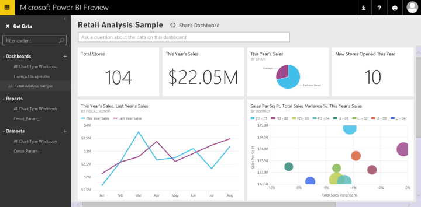
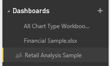

<properties pageTitle="Dashboards in Power BI Preview" description="Dashboards in Power BI Preview" services="powerbi" documentationCenter="" authors="v-anpasi" manager="mblythe" editor=""/>
<tags ms.service="powerbi" ms.devlang="NA" ms.topic="article" ms.tgt_pltfrm="NA" ms.workload="powerbi" ms.date="06/16/2015" ms.author="v-anpasi"/>
# Dashboards in Power BI Preview

[← Getting Started](https://support.powerbi.com/knowledgebase/topics/63037-getting-started)

Dashboards, reports, and datasets are at the heart of Power BI Preview. Create personalized ***dashboards*** to monitor your most important data, at a glance.  A dashboard combines on-premises and cloud-born data in a single pane of glass, providing a consolidated view across the organization regardless of where the data lives. Each metric, or insight, is displayed on the dashboard as a ***tile***. 

Need help understanding the building blocks that make up Power BI Preview?  See [Power BI Preview - Basic Concepts](http://support.powerbi.com/knowledgebase/articles/487029-power-bi-preview-basic-concepts).

When you first go to Power BI Preview, you're looking at a sample dashboard for retail data. For detailed information about the sample, see [Sample datasets](http://support.powerbi.com/knowledgebase/articles/471112-sample-datasets).

Each tile is a snapshot of information taken from the underlying dataset.  Learn how to [add tiles to a dashboard](http://support.powerbi.com/knowledgebase/articles/425669-tiles-in-power-bi). The tiles on a dashboard can be [resized, moved, deleted, and renamed](http://support.powerbi.com/knowledgebase/articles/424878-edit-a-tile-resize-move-rename-delete). 

Unless you remove it, the sample dashboard is always available for you to use to explore and learn. 

**NOTE:** The sample that comes with Power BI is read-only.  For a writable version of this sample dashboard and report, in the navigation pane, click Get Data \> Retail Analysis Sample. 

## Create a dashboard

Learn how to [create a new dashboard](http://support.powerbi.com/knowledgebase/articles/475163-create-a-power-bi-dashboard) and add tiles.

## Share a dashboard

Learn how to [share a dashboard with your co-workers](http://support.powerbi.com/knowledgebase/articles/431008-share-a-dashboard).

## Rename a dashboard

Need a more descriptive dashboard name? [Rename it](http://support.powerbi.com/knowledgebase/articles/475172-rename-a-dashboard).

## Delete a dashboard

Don't need the dashboard any more? [Delete it](http://support.powerbi.com/knowledgebase/articles/475173-delete-a-dashboard).

## Add tiles to a dashboard

[Get data](http://support.powerbi.com/knowledgebase/articles/434354-get-data) and [add tiles](http://support.powerbi.com/knowledgebase/articles/425669-tiles-in-power-bi) to your dashboard.

## Dashboard size

Dashboards can be wider and longer than the browser window. If so, they have scroll bars. Because you want to show everything important at a glance, we recommend making the dashboard fit the browser window. For more tips, see [Tips for designing a great dashboard](http://support.powerbi.com/knowledgebase/articles/433616-tips-for-designing-a-great-dashboard).

## Working with Dashboards in the navigation pane

Power BI Preview can have more than one dashboard -- as you add more dashboards, their titles are added to the list under the Dashboards heading.  The dashboard you're currently viewing is highlighted. Only one dashboard can be open at a time.

See Also:
---------

[Get Started with Power BI Preview](http://support.powerbi.com/knowledgebase/articles/430814-get-started-with-power-bi)  
[Power BI Preview - Basic Concepts](http://support.powerbi.com/knowledgebase/articles/487029-power-bi-preview-basic-concepts)
