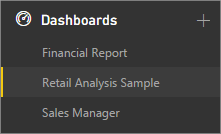

<properties
   pageTitle="Dashboards in Power BI"
   description="Dashboards in Power BI"
   services="powerbi"
   documentationCenter=""
   authors="mihart"
   manager="mblythe"
   editor=""
   tags=""/>

<tags
   ms.service="powerbi"
   ms.devlang="NA"
   ms.topic="article"
   ms.tgt_pltfrm="NA"
   ms.workload="powerbi"
   ms.date="01/26/2016"
   ms.author="mihart"/>

# Dashboards in Power BI

Dashboards, reports, and datasets are at the heart of Power BI. Create personalized ***dashboards*** to monitor your most important data, at a glance.  A dashboard combines on-premises and cloud-born data in a single pane of glass, providing a consolidated view across the organization regardless of where the data lives. Each metric, or insight, is displayed on the dashboard as a ***tile***. 

Need help understanding the building blocks that make up Power BI?  See [Power BI - Basic Concepts](powerbi-service-basic-concepts.md).

There are samples available for you to use with Power BI. Below shows the Retail Analysis Sample. For detailed information about the sample, see [Sample datasets](powerbi-sample-datasets.md).

Each tile is a snapshot of information taken from an underlying dataset.  Learn how to [add tiles to a dashboard](powerbi-service-dashboard-tiles.md). The tiles on a dashboard can be [resized, moved, deleted, linked, and renamed](powerbi-service-edit-a-tile-in-a-dashboard.md). 

### Create a dashboard

Learn how to [create a new dashboard](powerbi-service-create-a-dashboard.md) and add tiles.

### Add tiles to a dashboard

[Get data](powerbi-service-get-data.md) and [add tiles](powerbi-service-dashboard-tiles.md) and [images](powerbi-service-add-an-image-to-a-dashboard.md) to your dashboard  from reports, Q&A, SSRS, Excel, and more.

### Share a dashboard

Learn how to [share a read-only dashboard with your colleagues](powerbi-service-share-unshare-dashboard.md).

Learn how to [co-own a dashboard among colleagues](powerbi-service-organizational-content-packs-introduction.md).

### Rename a dashboard

Need a more descriptive dashboard name?  [Rename it](powerbi-service-rename-a-dashboard.md).

### Print a dashboard

Want to make hard copies of your dashboard?  [Print it](powerbi-service-print.md).

### Delete a dashboard

Don't need the dashboard any more?  [Delete it](powerbi-service-delete-or-remove-a-dashboard.md).

### Dashboard size

Display your dashboard without controls and menus using full screen [TV mode](powerbi-service-dash-and-reports-fullscreen.md).

Dashboards can be wider and longer than the browser window. If so, they have scroll bars. Because you want to show everything important at a glance, we recommend making the dashboard fit the browser window. For more tips, see [Tips for designing a great dashboard](powerbi-service-tips-for-designing-a-great-dashboard.md).

### Working with Dashboards in the navigation pane

Power BI can have more than one dashboard -- as you add more dashboards, their titles are added to the list under the **Dashboards** heading.  The dashboard you're currently viewing is highlighted. Only one dashboard can be open at a time.

## See also

[Get Started with Power BI](powerbi-service-get-started.md)

[Power BI - Basic Concepts](powerbi-service-basic-concepts.md)
