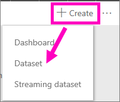
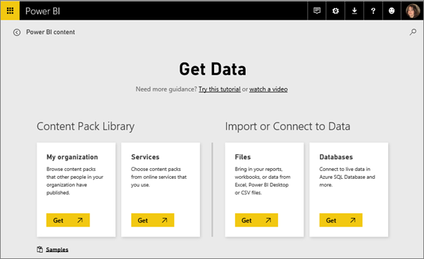
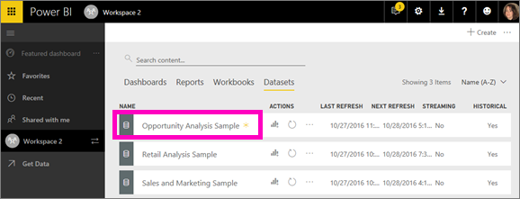

<properties
   pageTitle="Add a new dataset in Power BI"
   description="documentation for adding a new dataset in Power BI"
   services="powerbi"
   documentationCenter=""
   authors="mihart"
   manager="mblythe"
   backup=""
   editor=""
   tags=""
   qualityFocus="no"
   qualityDate=""/>

<tags
   ms.service="powerbi"
   ms.devlang="NA"
   ms.topic="article"
   ms.tgt_pltfrm="NA"
   ms.workload="powerbi"
   ms.date="11/10/2016"
   ms.author="mihart"/>
# Add a dataset
Data is at the heart of Power BI. Whenever you’re exploring data, creating charts and dashboards, asking questions with Q&A, all of those visualizations and answers you see are really getting their underlying data from a dataset. But where does that dataset come from? Well, from a data source.

To learn about all the different types of data sources you can connect to, see [Data sources for Power BI service](powerbi-service-get-data.md).  

To add a new dataset, start in a [workspace](powerbi-service-workspaces.md) and get some data. There is a separate procedure for adding *streaming* data, see Add streaming data from your workspace, below.

##  Add data to your workspace

1.  Navigate to the [workspace](powerbi-service-workspaces.md) where you'd like to add the dataset.

2. From the left navigation pane, select **Get Data** or, if the pane is collapsed, select the arrow icon .

        

    Or, from the top-right corner of your workspace, select **Create** > **Dataset**.

    
3.  You can get data from any of these data sources, and more.

    

    For detailed instructions, start with [data sources for Power BI](powerbi-service-get-data.md).

4.  The new dataset is added to your workspace and marked with a yellow asterisk to let you know that it's new.

    

##  Add streaming data to your workspace

1.  Navigate to the [workspace](powerbi-service-workspaces.md) where you'd like to add the streaming dataset.

2. From the top-right corner, select **Create** > **Streaming dataset**.

    

3.  Select the source for your streaming dataset.

    

## See also
[Power BI - Basic Concepts](powerbi-service-basic-concepts.md)

More questions? [Try the Power BI Community](http://community.powerbi.com/)
