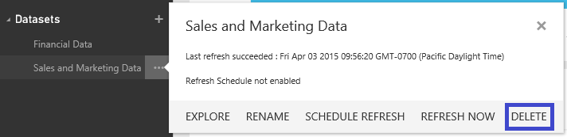

<properties pageTitle="Delete a dataset from Power BI" description="Delete a dataset from Power BI" services="powerbi" documentationCenter="" authors="v-anpasi" manager="mblythe" editor=""/>
<tags ms.service="powerbi" ms.devlang="NA" ms.topic="article" ms.tgt_pltfrm="NA" ms.workload="powerbi" ms.date="06/26/2015" ms.author="v-anpasi"/>
#Delete a dataset from Power BI

[← Get data](https://support.powerbi.com/knowledgebase/topics/63369-get-data)

Datasets can be deleted.  When you delete a dataset:

-   If the dataset connects to a file in OneDrive, the connection is deleted but the file itself is not deleted from OneDrive.
-   Dashboard tiles that use the dataset are deleted.
-   Reports that use the dataset are deleted.

In the navigation pane, right-click the dataset to delete and click **Delete**.

##See also

[Get started with Power BI](http://support.powerbi.com/knowledgebase/articles/430814-get-started-with-power-bi)  
[Get Data](http://support.powerbi.com/knowledgebase/articles/434354-get-data)  
[Power BI - Basic concepts](http://support.powerbi.com/knowledgebase/articles/487029-power-bi-preview-basic-concepts)