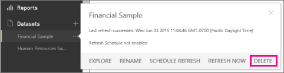

<properties 
   pageTitle="Delete a dataset from Power BI"
   description="Delete a dataset from Power BI"
   services="powerbi" 
   documentationCenter="" 
   authors="v-aljenk" 
   manager="mblythe" 
   editor=""
   tags=""/>
 
<tags
   ms.service="powerbi"
   ms.devlang="NA"
   ms.topic="article"
   ms.tgt_pltfrm="NA"
   ms.workload="powerbi"
   ms.date="10/14/2015"
   ms.author="v-aljenk"/>

# Delete a dataset from Power BI

Datasets can be deleted.  When you delete a dataset:

-   If the dataset connects to a file in OneDrive, the connection is deleted but the file itself is not deleted from OneDrive.

-   Dashboard tiles that use the dataset are deleted.

-   Reports that use the dataset are deleted.

In the navigation pane, right-click the dataset to delete and click **Delete**.

## See also

[Get started with Power BI](http://support.powerbi.com/knowledgebase/articles/430814)

[Get Data](http://support.powerbi.com/knowledgebase/articles/434354)

[Power BI - Basic concepts](http://support.powerbi.com/knowledgebase/articles/487029)
