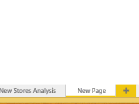

<properties
   pageTitle="Delete a page from a Power BI report"
   description="Delete a page from a Power BI report"
   services="powerbi"
   documentationCenter=""
   authors="mihart"
   manager="mblythe"
   editor=""
   tags=""/>

<tags
   ms.service="powerbi"
   ms.devlang="NA"
   ms.topic="article"
   ms.tgt_pltfrm="NA"
   ms.workload="powerbi"
   ms.date="01/20/2016"
   ms.author="mihart"/>

# Delete a page from a Power BI report

Hover over the tab of the page to delete and click the **X** (in the top right corner).  Sometimes the X is hard to see.

### See also

Read more about [reports in Power BI](powerbi-service-reports.md)

[Power BI - Basic Concepts](powerbi-service-basic-concepts.md)
