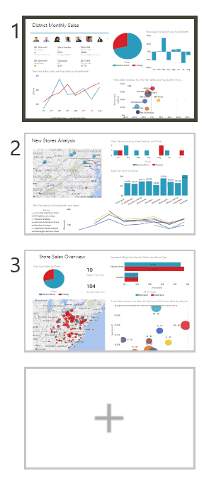

<properties pageTitle="Delete a page from a Power BI report" description="Delete a page from a Power BI report" services="powerbi" documentationCenter="" authors="v-anpasi" manager="mblythe" editor=""/>
<tags ms.service="powerbi" ms.devlang="NA" ms.topic="article" ms.tgt_pltfrm="NA" ms.workload="powerbi" ms.date="06/26/2015" ms.author="v-anpasi"/>
#Delete a page from a Power BI report

[← All about reports](https://support.powerbi.com/knowledgebase/topics/65157-all-about-reports)

Hover over the page to delete and click the **X** (in the top right corner).  Sometimes the X is hard to see.  
  
 
##See Also:

Read more about [reports in Power BI](http://support.powerbi.com/knowledgebase/articles/425684-reports-in-power-bi)  
[Power BI - Basic Concepts](http://support.powerbi.com/knowledgebase/articles/487029-power-bi-preview-basic-concepts)