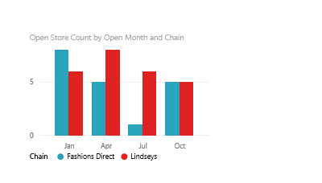

<properties
   pageTitle="Delete a visualization in Power BI"
   description="Delete a visualization in Power BI"
   services="powerbi"
   documentationCenter=""
   authors="mihart"
   manager="mblythe"
   editor=""
   tags=""/>

<tags
   ms.service="powerbi"
   ms.devlang="NA"
   ms.topic="article"
   ms.tgt_pltfrm="NA"
   ms.workload="powerbi"
   ms.date="10/14/2015"
   ms.author="mihart"/>
# Delete a visualization in Power BI

1.  In Power BI, open a report in [Editing View](powerbi-service-go-from-reading-view-to-editing-view.md)and [create a visualization](powerbi-service-add-visualizations-to-a-report-i.md) if your report doesn't already have one. 

2.  Select the ellipses (...) and choose **Remove**.

    

## See also

More about [Visualizations in Power BI reports](powerbi-service-visualizations-for-reports.md)

[Power BI - Basic Concepts](powerbi-service-basic-concepts.md)
