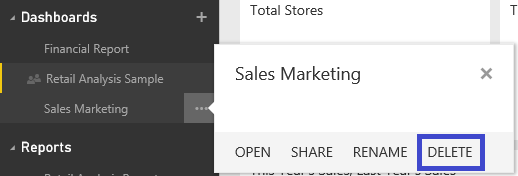

<properties pageTitle="Delete or remove a dashboard" description="Delete or remove a dashboard" services="powerbi" documentationCenter="" authors="v-anpasi" manager="mblythe" editor=""/>
<tags ms.service="powerbi" ms.devlang="NA" ms.topic="article" ms.tgt_pltfrm="NA" ms.workload="powerbi" ms.date="06/26/2015" ms.author="v-anpasi"/>
#Delete or remove a dashboard

[← All about dashboards](https://support.powerbi.com/knowledgebase/topics/65158-all-about-dashboards)

Dashboards can be deleted and removed.  Deleting and removing the dashboard does not delete the underlying dataset or any reports associated with that dashboard.

-   If you are the owner of the dashboard, you can delete it. If you've shared the dashboard with coworkers, deleting does not remove the dashboard from their Power BI.
-   If a dashboard is shared with you and you no longer want to see it, you can remove it.  Removing a dashboard does not remove it from anyone else's Power BI.
    

##To delete a dashboard

1.  In the navigation pane, right-click the dashboard to delete.

    
    
    
2.  Click **Delete**.  Deleting the dashboard does not delete the underlying dataset or any reports associated with that dashboard.

##To remove a dashboard

A lock icon  tells you that the dashboard is being [shared](http://support.powerbi.com/knowledgebase/articles/431008-share-a-dashboard)with you.  Shared dashboards are read-only and can't be deleted -- only removed. To remove a dashboard, follow the same steps as deleting, but click **Remove**.

##See Also:

[Dashboards in Power BI](http://support.powerbi.com/knowledgebase/articles/424868-dashboards-in-power-bi)  
[Get Started with Power BI](http://support.powerbi.com/knowledgebase/articles/430814-get-started-with-power-bi)  
[Power BI - Basic Concepts](http://support.powerbi.com/knowledgebase/articles/487029-power-bi-preview-basic-concepts)  

This is a draft topic in development. Feedback? Click **Contact support** on the right side of this page.