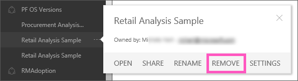

<properties
   pageTitle="Remove a dashboard"
   description="Remove a dashboard"
   services="powerbi"
   documentationCenter=""
   authors="mihart"
   manager="mblythe"
   editor=""
   tags=""
   qualityFocus="no"
   qualityDate=""/>

<tags
   ms.service="powerbi"
   ms.devlang="NA"
   ms.topic="article"
   ms.tgt_pltfrm="NA"
   ms.workload="powerbi"
   ms.date="01/19/2016"
   ms.author="mihart"/>

# Remove a dashboard  

Dashboards can be removed. Removing the dashboard does not delete the underlying dataset or any reports associated with that dashboard.

-   If you are the owner of the dashboard, you can remove it. If you've shared the dashboard with colleagues, removing the dashboard from your Power BI workspace does not remove the dashboard from their Power BI workspace.

-   If a dashboard is shared with you and you no longer want to see it, you can remove it.  Removing a dashboard does not remove it from anyone else's Power BI workspace.

-   If a dashboard is part of an [organizational content pack](powerbi-service-organizational-content-pack-delete.md), the only way to remove it is to remove the associated dataset.

## To remove a dashboard  
1.  In the navigation pane, right-click the dashboard to remove.  
    

2.  Click **Remove**.  Removing the dashboard does not delete the underlying dataset or any reports associated with that dashboard.

>**Note:**  
>Dashboards that are part of an organizational content packs have a different process for deleting.  See [Delete an organizational content pack](powerbi-service-organizational-content-pack-delete.md).

## See also  
[Dashboards in Power BI](powerbi-service-dashboards.md)  
[Get Started with Power BI](powerbi-service-get-started.md)  
[Power BI - Basic Concepts](powerbi-service-basic-concepts.md)  
