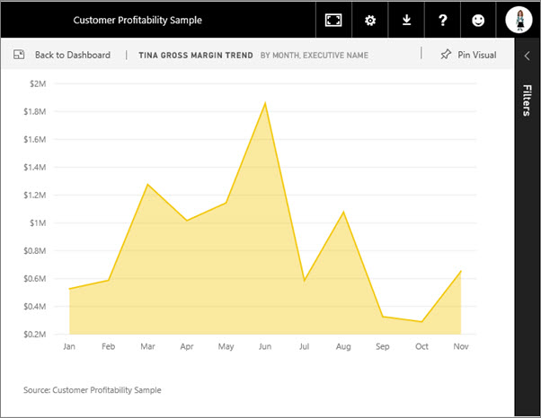
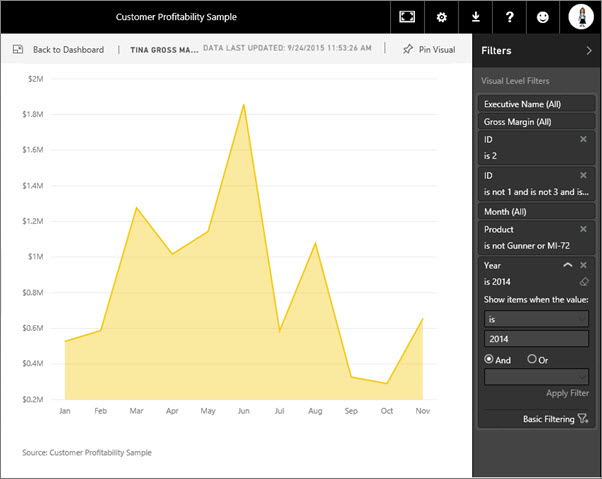

<properties
   pageTitle="Display a dashboard tile in Focus mode"
   description="Display a dashboard tile in Focus mode, aka Pop Out."
   services="powerbi"
   documentationCenter=""
   authors="mihart"
   manager="mblythe"
   editor=""
   tags=""
   qualityFocus="no"
   qualityDate=""/>

<tags
   ms.service="powerbi"
   ms.devlang="NA"
   ms.topic="article"
   ms.tgt_pltfrm="NA"
   ms.workload="powerbi"
   ms.date="01/26/2016"
   ms.author="mihart"/>

# Display a dashboard tile in Focus mode

## What is Focus mode?  

***Focus*** mode lets you expand (pop out) a dashboard tile to see more detail.  While in Focus mode, you can view and modify the filters that were applied when this tile visualization was created.

>**NOTE**: Currently, Focus mode is not available for tiles created from Q&A or for map tiles. 

>**NOTE**:
>Focus is different from full screen mode.  Full screen mode is available for [dashboards and reports ](powerbi-service-dash-and-reports-fullscreen.md) and [tiles](powerbi-service-display-tile-in-full-screen-mode.md).

1.  Hover over the tile and select the **Focus mode** icon .  
    

2.  The tile opens and fills the entire report canvas.  In this example, notice that the Y-axis displays with more detail.  The tile also displays the data source (bottom left corner).    
    

3.  Expand the Filters pane to see all filters applied to this visual.  
    

4.  Change the filter. Expand **Year** and change **2014** to **2013**.  
    

5.  It looks like Tina might be a new employee since we have no data for her for January through July of 2013.   
    

    Once in focus, the tile can then be [viewed in full screen (TV Mode.)](powerbi-service-display-tile-in-full-screen-mode.md) Full Screen Mode displays the tile without the distraction of menus and navigation buttons.

6.  Leave Focus mode and return to the dashboard by selecting the **Focus mode** icon (in the top left corner of the tile).

## See also  
[Dashboards in Power BI](powerbi-service-dashboards.md)  
[Power BI - Basic Concepts](powerbi-service-basic-concepts.md)
