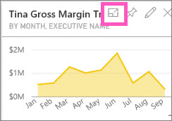
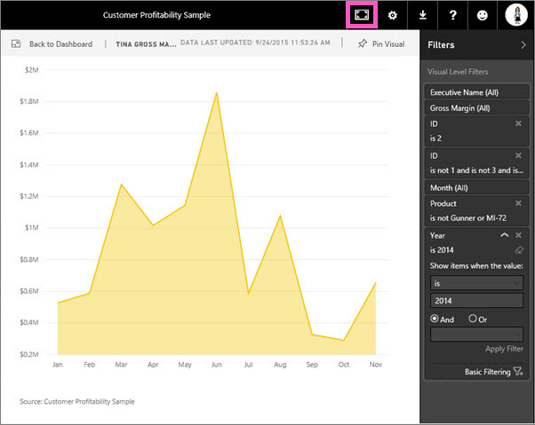

<properties
   pageTitle="Display a dashboard tile in full screen mode (In-focus mode)"
   description="Display a dashboard tile in full screen mode (In-focus mode)"
   services="powerbi"
   documentationCenter=""
   authors="mihart"
   manager="mblythe"
   editor=""
   tags=""/>

<tags
   ms.service="powerbi"
   ms.devlang="NA"
   ms.topic="article"
   ms.tgt_pltfrm="NA"
   ms.workload="powerbi"
   ms.date="10/27/2015"
   ms.author="mihart"/>

# Display a dashboard tile in full screen mode (In-focus mode)  

***In-focus*** mode lets you expand a dashboard tile to full screen and see more detail.  While in In-focus mode, you can view and modify the filters that were applied when this tile visualization was created. In-focus mode is similar to using Pop out for visualizations in reports.

>**Note**: 
>Currently, In-focus mode is not available for tiles created from Q&A or for map tiles. 

1.  Hover over the tile and select the In-focus icon .  
    

2.  The tile opens in full screen view.  Notice that the Y-axis displays with more detail.  The tile also displays the last updated date and time (at the top alongside the tile name) and the data source (bottom left corner).    
    
3.  Expand the Filters pane to see all filters applied to this visual.  
    
4.  Change the filter. Expand **Year** and change **2014** to **2013**.  
    
5.  It looks like Tina might be a new employee since we have no data for her for January through July of 2013.   
    

6.  Close In-focus mode and return to the dashboard by selecting **Back to Dashboard** (in the top right corner of the tile).

## See also  
[Dashboards in Power BI](powerbi-service-dashboards.md)  
[Power BI - Basic Concepts](powerbi-service-basic-concepts.md)  
