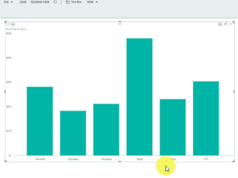

<properties
   pageTitle="Drill down in a visualization in Power BI"
   description="Drill down in a visualization in Power BI"
   services="powerbi"
   documentationCenter=""
   authors="mihart"
   manager="mblythe"
   editor=""
   tags=""/>

<tags
   ms.service="powerbi"
   ms.devlang="NA"
   ms.topic="article"
   ms.tgt_pltfrm="NA"
   ms.workload="powerbi"
   ms.date="11/30/2015"
   ms.author="mihart"/>

# Drill down in a visualization in Power BI

1.  In Power BI, open a report in [Reading View](powerbi-service-open-a-report-in-reading-view.md)or [Editing View](powerbi-service-go-from-reading-view-to-editing-view.md). Drill requires a visualization with a hierarchy. 

    A hierarchy is shown below.  The *Profit by Product *visualization has a hierarchy made up of **Product **and **Segment**; each product has one or more segments. By default, the visualization displays only the product data, because *Product *appears in the Axis bucket above *Segment*.

    **NOTE**: The animation below shows using drilldown in Editing View.  Editing View allows us to see the hierarchy -- the two fields in the Axis bucket.

2.  To enable drill down, select the arrow icon in the top right corner of the visualization. When the icon is dark, drill is enabled.

    

3.  To drill down one field at a time, double-click one of the chart bars. 

    

4.  To drill down all fields at once, select the double arrow in the top left corner of the visualization.

    

5.  To drill back up, select the up arrow in the top left corner of the visualization.

    

## See also

[Visualizations in Power BI reports](powerbi-service-visualizations-for-reports.md)

[Power BI Preview reports](powerbi-service-reports.md)

[Power BI Preview - Basic Concepts](powerbi-service-basic-concepts.md)
