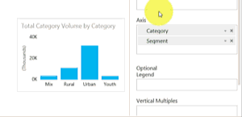

<properties pageTitle="Drill down in a visualization in Power BI" description="Drill down in a visualization in Power BI" services="powerbi" documentationCenter="" authors="v-anpasi" manager="mblythe" editor=""/>
<tags ms.service="powerbi" ms.devlang="NA" ms.topic="article" ms.tgt_pltfrm="NA" ms.workload="powerbi" ms.date="06/26/2015" ms.author="v-anpasi"/>
# Drill down in a visualization in Power BI
[← Visualizations in reports](https://support.powerbi.com/knowledgebase/topics/65160-visualizations-in-reports)
 
1.  In Power BI, open a report in [Reading View](http://support.powerbi.com/knowledgebase/articles/439920-open-a-report-in-reading-view) or [Editing View](http://support.powerbi.com/knowledgebase/articles/439921-go-from-report-reading-view-to-editing-view). Drilldown requires a visualization with a hierarchy.

    Another hierarchy is shown below.  The *Total Category by Segment* visualization has a hierarchy made up of **Category** and **Segment**; each category has one or more segments. By default, the visualization displays only the category data, because *Category* appears in the Axis bucket above *Segment*.
    
	NOTE: The animation below shows using drilldown in Editing View.  Editing View allows us to see the hierarchy -- the two fields in the Axis bucket.
    
2.  To drill down, double-click one of the chart bars.
    
3.  To drill back up, right click inside the visualization and select the up arrow.

    
    
## See Also:

[Visualizations in Power BI reports](http://support.powerbi.com/knowledgebase/articles/434821-visualizations-in-power-bi-reports)  
[Power BI reports](http://support.powerbi.com/knowledgebase/articles/425684-reports-in-power-bi-preview)  
[Power BI - Basic Concepts](http://support.powerbi.com/knowledgebase/articles/487029-power-bi-preview-basic-concepts)