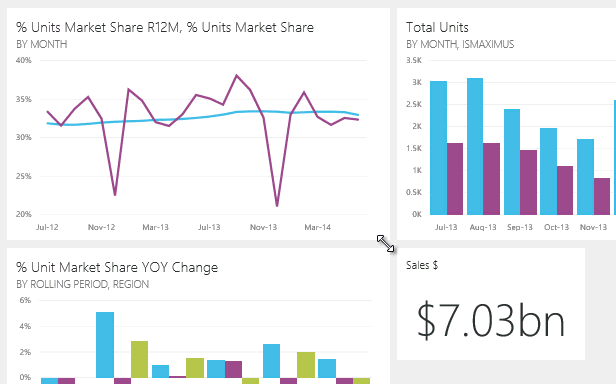

<properties pageTitle="Edit a tile -- resize, move, rename, delete" description="Edit a tile -- resize, move, rename, delete" services="powerbi" documentationCenter="" authors="v-anpasi" manager="mblythe" editor=""/>
<tags ms.service="powerbi" ms.devlang="NA" ms.topic="article" ms.tgt_pltfrm="NA" ms.workload="powerbi" ms.date="06/26/2015" ms.author="v-anpasi"/>
# Edit a tile -- resize, move, rename, delete

[← All about dashboards](https://support.powerbi.com/knowledgebase/topics/65158-all-about-dashboards)

You can change the look of a tile in a dashboard:
-   [Rename the tile](https://support.powerbi.com/knowledgebase/articles/424878#rename)
-   [Move the tile](https://support.powerbi.com/knowledgebase/articles/424878#move)
-   [Resize the tile](https://support.powerbi.com/knowledgebase/articles/424878#resize)
-   [Delete the tile](https://support.powerbi.com/knowledgebase/articles/424878#delete)  
 > NOTE: To change the visualization shown on the tile itself, delete the tile and add a new [dashboard tile](http://support.powerbi.com/knowledgebase/articles/425669-tiles-in-power-bi).

1.  In a [dashboard](http://support.powerbi.com/knowledgebase/articles/424868-dashboards-in-power-bi), [get data ](http://support.powerbi.com/knowledgebase/articles/434354-get-data)and add a tile. 

    

2.  Hover over a dashboard tile and:

### Rename the tile

    -   click the pencil icon   to edit the tile title.

### Move the tile

    -   click and hold the tile to drag it to a new location on the dashboard canvas.

### Resize the tile

    You can make tiles three different sizes -- small, medium, and large.

    -   click and drag the arrow  (in the bottom right corner) to resize the tile.

      
    ### Delete the tile

    -   click the X icon  to delete the tile. Deleting a tile does not delete the underlying report.
    

## See Also:

[Dashboard tiles in Power BI](http://support.powerbi.com/knowledgebase/articles/425669-tiles-in-power-bi)  
[Dashboards in Power BI](http://support.powerbi.com/knowledgebase/articles/424868-dashboards-in-power-bi)  
[Power BI - Basic Concepts](http://support.powerbi.com/knowledgebase/articles/487029-power-bi-preview-basic-concepts)
