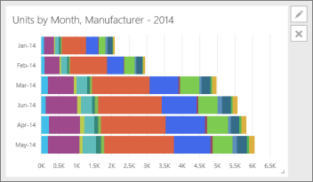

<properties
   pageTitle="Edit a tile -- resize, move, rename, pin, delete, add hyperlink"
   description="Edit a tile -- resize, move, rename, pin, delete, add hyperlink"
   services="powerbi"
   documentationCenter=""
   authors="mihart"
   manager="mblythe"
   editor=""
   tags=""/>

<tags
   ms.service="powerbi"
   ms.devlang="NA"
   ms.topic="article"
   ms.tgt_pltfrm="NA"
   ms.workload="powerbi"
   ms.date="10/14/2015"
   ms.author="mihart"/>

# Edit a tile -- resize, move, rename, pin, delete, add hyperlink

You can change the look and default behavior of a tile in a dashboard:

-   [Pin the tile to a different dashboard](#different)

-   [Rename the tile](#rename)

-   [Move the tile](#move)

-   [Resize the tile](#resize)

-   [Add a hyperlink to a tile](#hyperlink)

-   [Delete the tile](#delete)

>**Note**: To change the visualization shown on the tile itself, delete the tile and add a new [dashboard tile](powerbi-service-dashboard-tiles.md).

1. In a [dashboard](powerbi-service-dashboards.md), [get data ](powerbi-service-get-data.md)and add a tile. 

	

2. Hover over a dashboard tile and:

### Pin the tile to a different dashboard

1.  Select the pin icon  .

2.  Decide whether to pin to an existing dashboard or to a new dashboard. 

    

3.  Select **Pin**.

### Rename the tile

-   Select the pencil icon     to edit the tile title.

### Move the tile

-   Select and hold the tile to drag it to a new location on the dashboard canvas.

### Resize the tile

You can make tiles many different sizes -- from 1x1 tile units up to 5x5.

-   Select and drag the arrow  (in the bottom right corner) to resize the tile.

    

****

### Add a hyperlink to a dashboard tile

By default, clicking a tile takes you to the report where the tile was created or to Q&A (if the tile was created in Q&A). To link to a webpage, another dashboard, an SSRS report, or other online content - add a custom link:

1.  Select the pencil icon   to edit the tile.

2.  Place a checkmark in **Set custom link** and enter a URL.

### Delete the tile

-   Select the X icon  to delete the tile. Deleting a tile does not delete the underlying report.

## See Also

[Dashboard tiles in Power BI](powerbi-service-dashboard-tiles.md)

[Dashboards in Power BI](powerbi-service-dashboards.md)

[Power BI - Basic Concepts](powerbi-service-basic-concepts.md)
