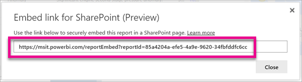
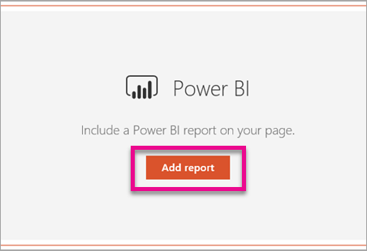
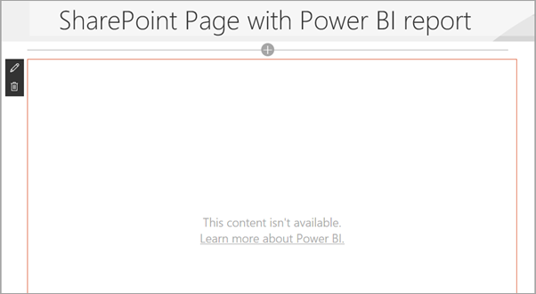

<properties
   pageTitle="Embed with report web part in SharePoint Online"
   description="With Power BI's new report web part for SharePoint Online, you can easily embed interactive Power BI reports in SharePoint Online pages."
   services="powerbi"
   documentationCenter=""
   authors="guyinacube"
   manager="erikre"
   backup=""
   editor=""
   tags=""
   featuredVideoId=""
   qualityFocus="no"
   qualityDate=""/>

<tags
   ms.service="powerbi"
   ms.devlang="NA"
   ms.topic="article"
   ms.tgt_pltfrm="NA"
   ms.workload="powerbi"
   ms.date="02/07/2017"
   ms.author="asaxton"/>
# Embed with report web part in SharePoint Online

With Power BI's new report web part for SharePoint Online, you can easily embed interactive Power BI reports in SharePoint Online pages.

When using the new **Embed in SharePoint Online** option, the embedded reports are fully secure so you can easily create secure internal portals.

> [AZURE.NOTE] **Embed in SharePoint Online** is only available with [Power BI Pro](powerbi-power-bi-pro-content-what-is-it.md). Each user that views the report mush have a Power BI Pro license. If they do not have a Pro license, they will be prompted to sign-up to view the report.

## Requirements

There are a few requirements in order for **Embed in SharePoint Online** reports to work. 

- The Power BI (Preview) web part for SharePoint Online requires new SharePoint features to be enabled. Your tenant needs to be enrolled in the [Set up the Standard or First Release options in Office 365](https://support.office.com/article/Set-up-the-Standard-or-First-Release-options-in-Office-365-3B3ADFA4-1777-4FF0-B606-FB8732101F47) program to use this feature.
- The Power BI (Preview) wbe part for SharePoint Online requires [Modern Pages](https://support.office.com/article/Allow-or-prevent-creation-of-modern-site-pages-by-end-users-c41d9cc8-c5c0-46b4-8b87-ea66abc6e63b).

## Embed your report

In order to embed your report into SharePoint Online, you will first need to get the URL for the report and then use that URL with the new Power BI (Preview) web part within SharePoint Online.

### Get a URL to your report

1. View the report within the Power BI service.

2. Select the **File** menu item.

3. Select **Embed in SharePoint Online (Preview)**.

    

4. Copy URL from dialog.

    

    > [AZURE.NOTE] You can also use the URL that is displayed in your web browser's address bar when viewing a report. That URL will contain the report page you are currently viewing. You will need to remove the report section, from the URL, if you want to use a different page.

### Add the Power BI report to a SharePoint Online page

1. Open the desired page in SharePoint Online and select **Edit**.

    

    Or, create a new modern site page by selecting **+ New** within SharePoint Online.

    

2. Select **+** and select the **Power BI (Preview)** web part.

    

3. Select **Add report**.

    

4. Past the report URL into the property pane. This is the URL you copied from the steps above. The report will load automatically.

    

5. Select **Publish** to make the change visible to your SharePoint Online users.

    

## Granting access to reports

Embedding a report in SharePoint Online does not automatically give users permission to view the report. The permissions to view the report are set within the Power BI service.

> [AZURE.IMPORTANT] Make sure to review who can see the report within the Power BI service and grant access to those not listed.

There are two ways to provide access to the report within the Power BI service. If you are using an Office 365 Group to build your SharePoint Online team site, you list the user as a member of the group workspace within the Power BI service. This will make sure that users can view the contents of that group. For more information, see [Creating groups in Power BI](powerbi-service-create-a-group-in-power-bi.md).

Alternatively, you can grant users access to your report by doing the following.

1. Add a tile from the report to a dashboard.

2. Share the dashboard with the users that need access to the report. For more information, see [Share a dashboard with colleagues and others](powerbi-service-share-unshare-dashboard.md).

## Web part settings

Below is a description of the settings that can be adjusted for the Power BI web part for SharePoint Online.

|Property|Description|
|---|---|
|Page name|Sets the default page that is shown by the web part. Select a value from the drop down. If no pages are displayed, either your report has one page, or the URL you pasted contains a page name. Remove the report section from the URL to select a specific page.|
|Display|Option to adjust how the report is fit within the SharePoint Online page.|
|Show Navigation Pane|Shows or hides the page navigation pane.|
|Show Filter Pane|Shows or hides the filter pane.|

## Multi-factor authentication

If your Power BI environment requires you to sign-in using multi-factor authentication, you may be asked to sign-in with a security device to verify your identity. This will occur if you did not sign-in to SharePoint Online using multi-factor authentication but your Power BI environment requires an account validated by a security device.

> [AZURE.NOTE] Multi-factor authentication is not yet supported with Azure Active Directory 2.0. Users will receive a message saying *error*. If the user signs-in again to SharePoint Online using their security device, they may be able to view the report.

## Reports that do not load

Your report may not load within the Power BI (Preview) web part and may show the following message.

*This content isn't available.*

There are two common reasons for this message.

1. You do not have access to the report.

2. The report was deleted.

You should contact the owner of the SharePoint Online page to help you resolve the issue.

## Known issues and limitations

- The Power BI (preview) web part for SharePoint Online does not support screen readers or keyboard navigation.

## See also

[Set up the Standard or First Release options in Office 365](https://support.office.com/article/Set-up-the-Standard-or-First-Release-options-in-Office-365-3B3ADFA4-1777-4FF0-B606-FB8732101F47)  
[Allow or prevent creation of modern site pages by end users](https://support.office.com/article/Allow-or-prevent-creation-of-modern-site-pages-by-end-users-c41d9cc8-c5c0-46b4-8b87-ea66abc6e63b)  
[Creating groups in Power BI](powerbi-service-create-a-group-in-power-bi.md)  
[Share a dashboard with colleagues and others](powerbi-service-share-unshare-dashboard.md)  
More questions? [Try the Power BI Community](http://community.powerbi.com/)