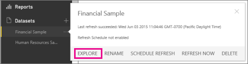
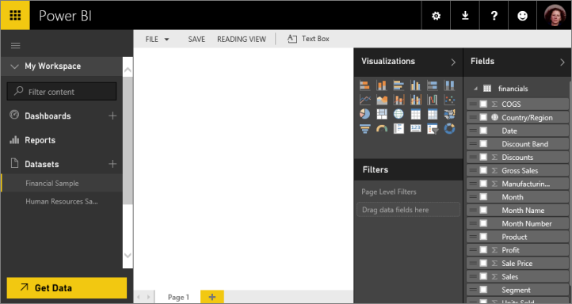

<properties 
   pageTitle="Explore a dataset in Power BI"
   description="Explore a dataset in Power BI"
   services="powerbi" 
   documentationCenter="" 
   authors="pcw3187" 
   manager="mblythe" 
   editor=""
   tags=""/>
 
<tags
   ms.service="powerbi"
   ms.devlang="NA"
   ms.topic="article"
   ms.tgt_pltfrm="NA"
   ms.workload="powerbi"
   ms.date="10/14/2015"
   ms.author="v-pawrig"/>
# Explore a dataset in Power BI

[← Get data](https://support.powerbi.com/knowledgebase/topics/63369-get-data)

Exploring a dataset is similar to [creating a report](http://support.powerbi.com/knowledgebase/articles/425684-reports-in-power-bi).  When you click **Explore** you'll see the same canvas, navigation, and Fields and Filters pane. Dataset explore always starts with a blank canvas and always opens in [Editing View](http://support.powerbi.com/knowledgebase/articles/443094-edit-a-report). Use dataset explore to dig into your data, create visualizations, create reports, and pin visualizations to your dashboard.

## Open your dataset

1.  [Get data](http://support.powerbi.com/knowledgebase/articles/434354-get-data).

2.  Right-click the dataset you'd like to explore and select **Explore**. 

    

3.  Power BI opens a new blank report based on the dataset.

    

From this point, you can start [creating visualizations the way you do in report Editing View](https://powerbi.uservoice.com/knowledgebase/articles/441777-part-i-add-visualizations-to-a-power-bi-report).  

Now you can:

-   [Pin a tile from your report](http://support.powerbi.com/knowledgebase/articles/430323-pin-a-tile-to-a-dashboard-from-a-report) to a dashboard.

-   [Add a new page](http://support.powerbi.com/knowledgebase/articles/474804-add-a-page-to-a-power-bi-report) to your report.

-   [Delete a page](http://support.powerbi.com/knowledgebase/articles/474805-delete-a-page-from-a-power-bi-report) from your report.

-   [Reorder pages](http://support.powerbi.com/knowledgebase/articles/475186-reorder-pages-in-a-report) in your report.# See also

### See also

[Sample datasets available for your use](http://support.powerbi.com/knowledgebase/articles/471112-sample-datasets)

[Get data to use](http://support.powerbi.com/knowledgebase/articles/434354-get-data)

[Rename a dataset](http://support.powerbi.com/knowledgebase/articles/475376-rename-a-dataset).

[Delete a dataset](http://support.powerbi.com/knowledgebase/articles/475378-delete-a-dataset)

