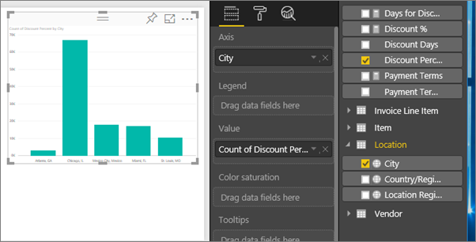

<properties
   pageTitle="Export data from a visualization"
   description="Export data from a report visualization and dashboard visualization and view it in Excel."
   services="powerbi"
   documentationCenter=""
   authors="mihart"
   manager="mblythe"
   backup=""
   editor=""
   tags=""
   featuredVideoId="jtlLGRKBvXY"
   qualityFocus="no"
   qualityDate=""/>

<tags
   ms.service="powerbi"
   ms.devlang="NA"
   ms.topic="article"
   ms.tgt_pltfrm="NA"
   ms.workload="powerbi"
   ms.date="02/15/2017"
   ms.author="mihart"/>

# Export data from Power BI visualizations

If you'd like to see the data that is used to create a visualization, you can [display that data in Power BI](powerbi-service-reports-see-data.md) or export that data to Excel as an .xlsx or .csv file.   

Watch Will export the data from one of the visualizations in his report, save it as an .xlsx file, and open it in Excel. Then follow the step-by-step instructions below the video to try it out yourself.

<iframe width="560" height="315" src="https://www.youtube.com/embed/KjheMTGjDXw" frameborder="0" allowfullscreen></iframe>

## From a visualization on a Power BI dashboard

1. Select the ellipses in the top right corner of the visualization.

    

2. Choose the  **Export data** icon.

    

3. The data is exported to a .csv file. If the visual is filtered, then the downloaded data will also be filtered.

4. Your browser will prompt you to save the file.  Once saved, open the .csv file in Excel.

    

## From a visualization in a report
To follow along, open the [Procurement analysis sample report](powerbi-sample-procurement-analysis-take-a-tour.md) in [Editing view](powerbi-sesrvice-go-from-reading-view-to-editing-view.md). [Add a new blank report page](powerbi-service-add-a-page-to-a-report.md). Then follow the steps below to add an aggregation and a visualization-level filter.

1. Create a new column chart.  From the Fields pane, select **Location > City** and **Invoice > Discount Percent**.   

    

2. Change the aggregation for **Discount Percent** from **Count** to **Average**. In the Value well, select the arrow to the right of **Discount Percent** (it may say **Count of Discount Percent**), and choose **Average**.

    

3.  Add a filter to **City** to remove **Atlanta**.

    

    Now we're ready to try out both options for exporting data.

4.  Select the ellipses in the top right corner of the visualization. Choose  **Export data**.

    

5. If your visualization has an aggregate (one example would be if you changed **Count** to *average*, **sum** or *minimum*),  you'll have two options: **Summarized data** and **Underlying data**. For help understanding aggregates, see [Aggregates in Power BI](powerbi-service-aggregates.md).

    

6.  Select **Summarized data** > **Export** and choose either .xlsx or .csv. Power BI exports the data.  If you have applied filters to the visualization, the exported data will export as filtered. When you select  **Export**, your browser prompts you to save the file. Once saved, open the file in Excel.

    **Summarized data**: select this option if you don't have an aggregate or if you do have an aggregate but don't want to see the complete breakdown. For example, if you have a bar chart showing 4 bars, you will get 4 rows of data. Summarized data is available as .xlsx and .csv.

    In this example, our Excel export shows one total for each city. Since we filtered out Atlanta, it is not included in the results.  The first row of our spreadsheet shows the filters that were used when extracting the data from Power BI.

    

7.  Now try selecting **Underlying data** > **Export** and choosing .xlsx. Power BI exports the data. If you had applied filters to the visualization, the exported data will export as filtered. When you select  **Export**, your browser prompts you to save the file. Once saved, open the file in Excel.

    **Underlying data**: select this option if your visualization does have an aggregate and you'd like to see all the underlying details. Basically, selecting *Underlying data* removes the aggregate. When you select **Export**, the data is exported to an .xlsx file and your browser prompts you to save the file. Once saved, open the file in Excel.

    In this example, our Excel export shows one row for every single City row in our dataset, and the discount percent for that single entry. In other words, the data is flattened and not aggregated. The first row of our spreadsheet shows the filters that were used when extracting the data from Power BI.  

    

## Limitations and considerations

-  The maximum number of rows that can be exported to .csv is 30,000.

- The maximum number of rows that can be exported to .xlsx is 30,000 (for Power BI Free users) and 150,000 (for Power BI Pro users).

- Power BI only supports export of visualizations that use implicit measures (no support for calculated (explicit) measures as aggregates).

-  Custom visuals, and R visuals, are not currently supported.

-  If there is unicode in the .csv file, the text in Excel may not display properly. Although, opening it in Notepad will work fine. Examples of unicode are currency symbols and foreign words. the workaround for this is to import the csv into Excel, instead of opening the csv directly. To do this:

   1. Open Excel

   2. From the **Data** tab, select **Get external data** > **From text**.

## See also

[Dashboards in Power BI](powerbi-service-dashboards.md)

[Reports in Power BI](powerbi-service-reports.md)

[Power BI - Basic Concepts](powerbi-service-basic-concepts.md)

More questions? [Try the Power BI Community](http://community.powerbi.com/)
