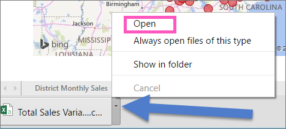

<properties
   pageTitle="Export data from a visualization"
   description="Export data from a report visualization and dashboard visualization"
   services="powerbi"
   documentationCenter=""
   authors="mihart"
   manager="mblythe"
   editor=""
   tags=""/>

<tags
   ms.service="powerbi"
   ms.devlang="NA"
   ms.topic="article"
   ms.tgt_pltfrm="NA"
   ms.workload="powerbi"
   ms.date="12/21/2015"
   ms.author="mihart"/>

# Export data from Power BI visualizations
Visualization data can be exported from visualizations on a dashboard and from report visualizations.

## Export data on a dashboard

1. Select the ellipses in the top right corner of the visualization. Choose the  **Export data** icon.

    

2. Exported data appears in the bottom left corner of Power BI, below the **Get Data** button.

    

3. To open the data file, select the arrow and choose **Open**.

    

## Export data in a report

1. Select the ellipses in the top right corner of the visualization. Choose  **Export data**.

    

2. See steps 2 and 3 above.

## See also

[Dashboards in Power BI](powerbi-service-dashboards.md)

[Reports in Power BI](powerbi-service-reports.md)

[Power BI - Basic Concepts](powerbi-service-basic-concepts.md)
