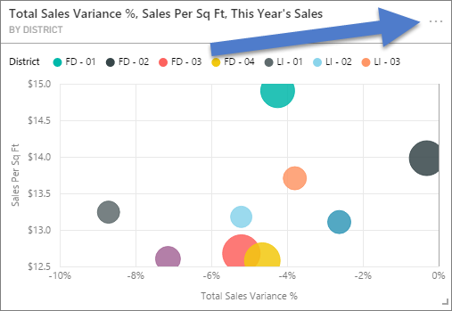

<properties
   pageTitle="Export data from a visualization"
   description="Export data from a report visualization and dashboard visualization"
   services="powerbi"
   documentationCenter=""
   authors="mihart"
   manager="mblythe"
   backup=""
   editor=""
   tags=""
   featuredVideoId="jtlLGRKBvXY"
   qualityFocus="no"
   qualityDate=""/>

<tags
   ms.service="powerbi"
   ms.devlang="NA"
   ms.topic="article"
   ms.tgt_pltfrm="NA"
   ms.workload="powerbi"
   ms.date="08/25/2016"
   ms.author="mihart"/>

# Export data from Power BI visualizations
Data can be exported from visuals on a dashboard and in reports.  

>**NOTE**: The maximum number of rows that can be downloaded is 10,000.

Watch Amanda export the data used in her dashboard and save it as a .csv file. Then follow the step-by-step instructions below the video to try it out yourself.

<iframe width="560" height="315" src="https://www.youtube.com/embed/jtlLGRKBvXY?start=61" frameborder="0" allowfullscreen></iframe>

## Export a dashboard visual's data

1. Select the ellipses in the top right corner of the visualization.

    

2. Choose the  **Export data** icon.

    

    The data is exported to a CSV file. If the visual is filtered, then the downloaded data will also be filtered.

3. Open the CSV file in Excel.

    

    >**NOTE**: If there is unicode in the .csv file, the text in Excel may not display properly. Although, opening it in Notepad will work fine. Examples of unicode are currency symbols and foreign words. the workaround for this is to import the csv into Excel, instead of opening the csv directly. To do this:
    1. Open Excel
    2. From the **Data** tab, select **Get external data** > **From text**.

## Export a report visual's data

1. Select the ellipses in the top right corner of the visualization. Choose  **Export data**.

    

    >**NOTE**: The option to remove a visual is only available in [report Editing View](powerbi-service-go-from-reading-view-to-editing-view.md).

2. See step 3 above.

## See also

[Dashboards in Power BI](powerbi-service-dashboards.md)

[Reports in Power BI](powerbi-service-reports.md)

[Power BI - Basic Concepts](powerbi-service-basic-concepts.md)
