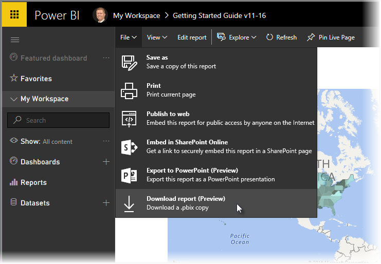
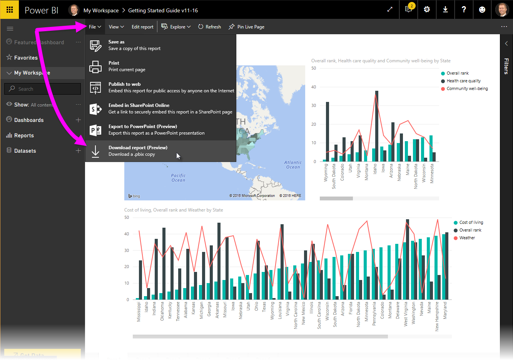
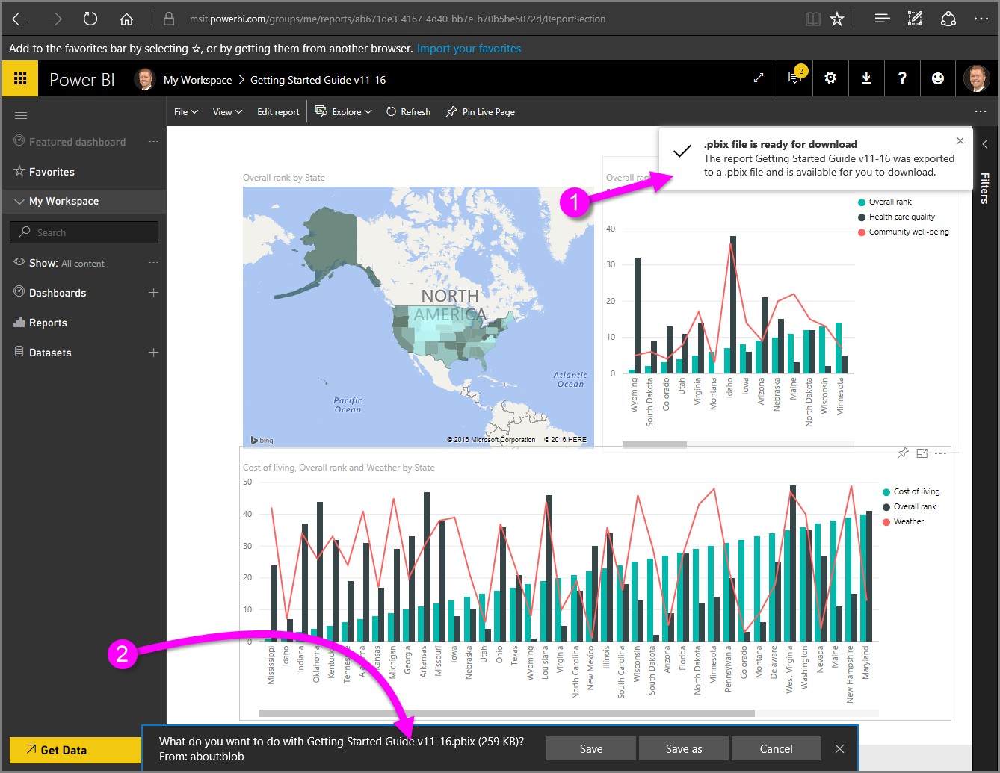

<properties
   pageTitle="Export a Power BI report to Power BI Desktop (.pbix)"
   description="Download a report from the Power BI service to a Power BI Desktop file"
   services="powerbi"
   documentationCenter=""
   authors="davidi"
   manager="mblythe"
   backup=""
   editor=""
   tags=""
   qualityFocus="no"
   qualityDate=""/>

<tags
   ms.service="powerbi"
   ms.devlang="NA"
   ms.topic="article"
   ms.tgt_pltfrm="NA"
   ms.workload="powerbi"
   ms.date="11/30/2016"
   ms.author="davidi"/>

# Export (download) a Power BI service report for use in Power BI Desktop
In the **Power BI** service, you can easily export a report (also referred to as *downloading a report*) so you can open (and modify, if you want) the report in **Power BI Desktop**. The file extension used for **Power BI Desktop** files is *.pbix*. There are a few limitations and considerations to keep in mind, which are discussed later in this article.

To download the .pbix file, follow these steps:

1. In **Power BI**, open the report you want to download and select **File > Download report (Preview)**.

    

    > **Note:** The report must have been uploaded to the **Power BI service** November 24, 2016 - or updated since then - to be able to download the report. If it hasn't, the *Download Report* menu option in the **Power BI service** is grayed out.

2. While the report is being created, a status banner displays the progress (**1** in the image below). When the file is ready, the browser displays a download banner to let you decide what to do with the file (**2** in the image below). The name of the file matches the title of the report.

    

Once you download the file, you can open it in **Power BI Desktop** and work on it however you would like. There are a few different ways you can [get Power BI Desktop](powerbi-desktop-get-the-desktop.md).

## Limitations and Considerations

There are a few important considerations and limitations associated with downloading (exporting) a *.pbix* file from the **Power BI service**:

-   To download the file, you must have edit access to the report
-   The report must have originated from **Power BI Desktop**, either by being *published* to the **Power BI service** or by uploading a *.pbix* file to the service.
-   This feature will not work with reports originally created in the **Power BI service**, including content packs.
-   Reports must be published or updated after November 24, 2016. Reports published prior to then are not downloadable.
-   You should always be using the latest version of **Power BI Desktop** when opening downloaded files. Downloaded *.pbix* files may not open in non-current versions of **Power BI Desktop**.
-   If your administrator has turned off the ability to export data, this feature will not be visible in the **Power BI service**.

## See also

You can view the **Guy in a Cube** one-minute video about this feature:

<iframe width="560" height="315" src="https://www.youtube.com/embed/ymWqU5jiUl0" frameborder="0" allowfullscreen></iframe>

Also, here are some additional articles that can help you learn to use the **Power BI service**:

-   [Dashboards in Power BI](powerbi-service-dashboards.md)
-   [Reports in Power BI](powerbi-service-reports.md)
-   [Power BI - Basic Concepts](powerbi-service-basic-concepts.md)

Once you get **Power BI Desktop** installed, the following content can help you get up and running quickly:

-   [Getting Started with Power BI Desktop](powerbi-desktop-getting-started.md)
-   [Query Overview with Power BI Desktop](powerbi-desktop-query-overview.md)
-   [Data Sources in Power BI Desktop](powerbi-desktop-data-sources.md)
-   [Connect to Data in Power BI Desktop](powerbi-desktop-connect-to-data.md)
-   [Shape and Combine Data with Power BI Desktop](powerbi-desktop-shape-and-combine-data.md)
-   [Common Query Tasks in Power BI Desktop](powerbi-desktop-common-query-tasks.md)   
