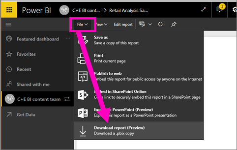

<properties
   pageTitle="Export a Power BI service report to Power BI Desktop (Preview)"
   description="Download a report from the Power BI service to a Power BI Desktop file"
   services="powerbi"
   documentationCenter=""
   authors="mihart"
   manager="mblythe"
   backup=""
   editor=""
   tags=""
   qualityFocus="no"
   qualityDate=""/>

<tags
   ms.service="powerbi"
   ms.devlang="NA"
   ms.topic="article"
   ms.tgt_pltfrm="NA"
   ms.workload="powerbi"
   ms.date="12/11/2016"
   ms.author="mihart"/>

# Export (download) a Power BI service report for use in Power BI Desktop (Preview)
In the **Power BI** service, you can export a report (also referred to as *downloading a report*) so you can open (and modify, if you want) the report in **Power BI Desktop**. The file extension used for **Power BI Desktop** files is *.pbix*. There are a few limitations and considerations to keep in mind, which are discussed later in this article.

##  Download the report as a .pbix

To download the .pbix file, follow these steps:

1. In **Power BI service**, open the report you want to download in [Editing view](powerbi-service-go-from-reading-view-to-editing-view.md).

2.  From the menubar, select **File > Download report**.

    

    > **Note:** The report must have been [created using Power BI Desktop](powerbi-learning-4-1-publish-reports.md) after November 23, 2016 - or updated since then - to be able to download the report. If it hasn't, the *Download Report* menu option in Power BI service is grayed out.

3. While the .pbix file is being created, a status banner displays the progress. When the file is ready, you'll be asked to save the .pbix file. The name of the file matches the title of the report.

    

Once you download the file, you can open it in **Power BI Desktop** and work on it however you would like. There are a few different ways you can [get Power BI Desktop](powerbi-desktop-get-the-desktop.md).

## Limitations and Considerations

There are a few important considerations and limitations associated with downloading (exporting) a *.pbix* file from Power BI service.

-   To download the file, you must have edit access to the report
-   The report must have originated from **Power BI Desktop** and been *published* to the **Power BI service**, or the .pbix must have been *uploaded* to the service.
-   Reports must be published or updated after November 23, 2016. Reports published prior to then are not downloadable.
-   This feature will not work with reports originally created in the **Power BI service**, including content packs.
-   You should always be using the latest version of **Power BI Desktop** when opening downloaded files. Downloaded *.pbix* files may not open in non-current versions of **Power BI Desktop**.
-   If your administrator has turned off the ability to export data, this feature will not be visible in the **Power BI service**.

## See also

You can view the **Guy in a Cube** one-minute video about this feature:

<iframe width="560" height="315" src="https://www.youtube.com/embed/ymWqU5jiUl0" frameborder="0" allowfullscreen></iframe>

Also, here are some additional articles that can help you learn to use **Power BI service**:

-   [Dashboards in Power BI](powerbi-service-dashboards.md)
-   [Reports in Power BI](powerbi-service-reports.md)
-   [Power BI - Basic Concepts](powerbi-service-basic-concepts.md)

Once you get **Power BI Desktop** installed, the following content can help you get up and running quickly:

-   [Getting Started with Power BI Desktop](powerbi-desktop-getting-started.md)

More questions? [Try the Power BI Community](http://community.powerbi.com/)   
