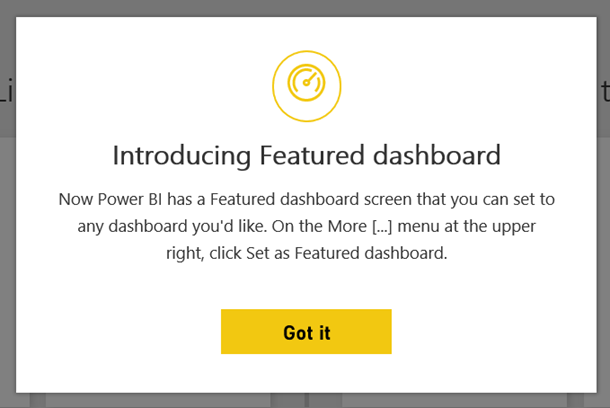

<properties
   pageTitle="Featured dashboards in Power BI service"
   description="Documentation on how to mark dashboards as **featured** in Power BI service"
   services="powerbi"
   documentationCenter=""
   authors="mihart"
   manager="mblythe"
   backup=""
   editor=""
   tags=""
   qualityFocus="no"
   qualityDate=""/>

<tags
   ms.service="powerbi"
   ms.devlang="NA"
   ms.topic="article"
   ms.tgt_pltfrm="NA"
   ms.workload="powerbi"
   ms.date="11/08/2016"
   ms.author="mihart"/>

# Featured dashboards in Power BI

##  About featured dashboards
Many of you have one dashboard that you visit more than any others.  It might be the dashboard you use to run your business, or it might contain an aggregation of tiles from many different dashboards and reports.

To make it easier to reach the dashboard you care about most, we added the ability to feature a dashboard in your workspace. This means Power BI will always open to this dashboard (instead of the last dashboard you visited).  And you can reach your featured dashboard at any time by selecting  **Featured dashboard** in the left navigation pane.

> [AZURE.NOTE] You can also select a few dashboards and set them as *favorites*. See [Dashboard favorites](powerbi-service-favorite-dashboards.md).

The first time you log into Power BI you will see a pop-up notification letting you know about featured dashboard.

The **Featured dashboard** section of your left navpane will be greyed out until you set a dashboard as featured.

## To set a dashboard as **Featured**
Watch Amanda create a featured dashboard and then follow the instructions below the video to try it out yourself.
<iframe width="560" height="315" src="https://www.youtube.com/embed/7-gQWhUZSsk" frameborder="0" allowfullscreen></iframe>

1.  Open a dashboard.

2.  From the top-right corner of the dashboard, select the ellipses (...), and choose **Set as featured dashboard**.

    

3.  Confirm your selection.

    

4.  After you see the Success message, the **Featured dashboard** option is activated in the left navpane.

    

##  Change the Featured dashboard
Of course, if you change your mind later you can set a new dashboard as the featured dashboard, or you can remove the featured dashboard altogether.

1.  From the leftnav, select the ‘…’ next to **Featured dashboard** and choose **Disable featured dashboard**.

    

2.  Confirm that you no longer want to feature this particular dashboard. Un-featuring a dashboard does not remove it from your workspace.  

    

##  See also
[Get Started with Power BI](powerbi-service-get-started.md)
[Power BI - Basic Concepts](powerbi-service-basic-concepts.md)

More questions? [Try the Power BI Community](http://community.powerbi.com/)
