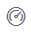

<properties
   pageTitle="Featured dashboards in Power BI"
   description="Documentation on how to create a Featured dashboard in Power BI"
   services="powerbi"
   documentationCenter=""
   authors="mihart"
   manager="erikre"
   backup=""
   editor=""
   tags=""
   featuredVideoId=""
   qualityFocus="no"
   qualityDate=""/>

<tags
   ms.service="powerbi"
   ms.devlang="NA"
   ms.topic="article"
   ms.tgt_pltfrm="NA"
   ms.workload="powerbi"
   ms.date="05/03/2017"
   ms.author="mihart"/>

# Featured dashboards in Power BI

## Create a Featured dashboard

Many of you have one dashboard that you visit more than any others.  It might be the dashboard you use to run your business, or it might contain an aggregation of tiles from many different dashboards and reports.

When you select a dashboard as *featured*, each time you open Power BI service, it will open with that dashboard displayed.  

>**NOTE**: You can also select a few dashboards and set them as *favorites*. See [Dashboard favorites](powerbi-service-favorite-dashboards.md).

If you haven't yet set a Featured dashboard, Power BI will open to the last dashboard you used.  

### To set a dashboard as **Featured**

Watch Amanda create a featured dashboard and then follow the instructions below the video to try it out yourself.

<iframe width="560" height="315" src="https://www.youtube.com/embed/7-gQWhUZSsk" frameborder="0" allowfullscreen></iframe>

1. Open the dashboard that you'd like to set as *Featured*. 

2. In the top navbar, you'll either see **Set as featured** or just the Featured    icon. Select either one.

    

2. Confirm your selection.

    

## Change the Featured dashboard

Of course, if you change your mind later you can set a new dashboard as the featured dashboard.

1. Follow steps 1 and 2 from above.

    

2. Select **Set as featured**. Un-featuring a dashboard does not remove it from your workspace.  

    

##  Remove the Featured dashboard
If you decide that you don't want any dashboard to be designated as featured, here's how to un-feature a dashboard.

1.    Open the currently-featured dashboard.

2. In the top menubar, select **Disable featured**.

    

## Next steps

[Favorite a dashboard](powerbi-service-favorite-dashboards.md)

More questions? [Try the Power BI Community](http://community.powerbi.com/)
