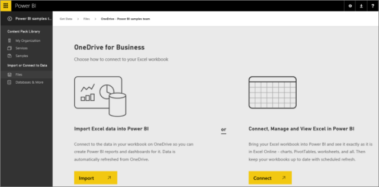

<properties 
   pageTitle="Get data from Excel, Power BI Desktop, and CSV files into Power BI"
   description="Get data from Excel, Power BI Desktop, and CSV files into Power BI"
   services="powerbi" 
   documentationCenter="" 
   authors="v-anpasi" 
   manager="mblythe" 
   editor=""
   tags=""/>
 
<tags
   ms.service="powerbi"
   ms.devlang="NA"
   ms.topic="article"
   ms.tgt_pltfrm="NA"
   ms.workload="powerbi"
   ms.date="09/28/2015"
   ms.author="v-anpasi"/>
# Get data from Excel, Power BI Desktop, and CSV files into Power BI

**Excel files**

If Excel is your go-to tool for working with data, you can leverage your Excel expertise and investments by using them in Power BI. You have two options:

-   Use an XLSX Excel workbook as a dataset for your Power BI dashboards and reports. Read about [what makes a good Excel workbook](https://support.powerbi.com/knowledgebase/articles/424871) for Power BI.  Want a sample Excel file to use as dataset? Download the [Financial Sample Excel file](https://support.powerbi.com/knowledgebase/articles/497124).

-   Bring a whole Excel workbook into Power BI intact . Explore the whole file, exactly as you would in Excel Online. [Bring whole Excel files into Power BI](https://support.powerbi.com/knowledgebase/articles/640168)

**Power BI Desktop files**

You can also create reports in Power BI Desktop, a free, downloadable app, and use those reports as datasets for Power BI. [Get Power BI Desktop](https://support.powerbi.com/knowledgebase/articles/464158).

**CSV files**

A comma-separated values (CSV) text file can be a dataset for your Power BI dashboards and reports, too. For best results, CSV files need to use comma delimiters and have a header row. [Download a sample CSV file](http://go.microsoft.com/fwlink/?LinkID=619356).

### Import or connect to files 

You can upload Excel, Power BI Desktop, and CSV files from your computer, or connect to them on OneDrive for Business or OneDrive Personal. Here's the advantage of connecting to files on OneDrive: Changes to a file on OneDrive appear automatically in the dashboards and reports connected to the file in Power BI.

**Important**: In Power BI Preview, the maximum file size is 250 megabytes for any file you upload to your Power BI site.

1.  Starting from the dashboard to which you want to add the workbook data, select **Get Data** at the bottom of the left navigation pane. 

    

2.  In the **Files** box, select **Get**.

    

3. ** Depending on where your file is, select one of these options:**

    

    **Local File:** Browse to the file and select Open. Power BI uploads files on your computer to Power BI. 

    **OneDrive - Business** and **OneDrive - Personal**: Browse to the file and select **Connect**. Power BI creates a connection to the file. Any changes to files on OneDrive appear automatically in Power BI.

    Note: Power BI doesn't change the files on OneDrive. Read more about [refreshing data in Excel workbooks on OneDrive](https://support.powerbi.com/knowledgebase/articles/471009). 

4.  In OneDrive for Business, under **Import Excel data into Power BI**, select **Import**. Power BI creates a dataset based on the data model in the workbook.

    

5.  Power BI adds the new dataset. New items are marked with a yellow asterisk .  

    **Excel workbooks**: If the workbook has Power View sheets, Power BI combines them to create a report. The report has the same name as the dataset, under the **Reports** heading. 

    **Power BI Desktop files**: Power BI creates a report and a dataset with the same name.

    

    **Tip**: Any changes you make in Power BI -- for example, add, delete, or change visualizations in reports -- aren't saved in the original Excel or Power BI Desktop file. You can only change an Excel file in Excel, and a Power BI Desktop file in Power BI Desktop. You can change the dataset and report names.  

### What can you do next?

-   Click the dataset name to [explore the dataset in Power BI](powerbi-service-explore-a-dataset.md).

-   Or just type a [question in the Q&A box](powerbi-service-q-and-a.md) on the dashboard.

-   [Pin visualizations to your dashboard](powerbi-service-pin-a-tile-to-a-dashboard-from-a-report.md). 

### More about files in Power BI

-   [Excel data in Power BI](https://support.powerbi.com/knowledgebase/articles/424871-excel-data-in-power-bi)

-   [Refresh Excel data stored in OneDrive](https://support.powerbi.com/knowledgebase/articles/471009)

-   [Bring whole Excel files into Power BI](https://support.powerbi.com/knowledgebase/articles/640168%20)

