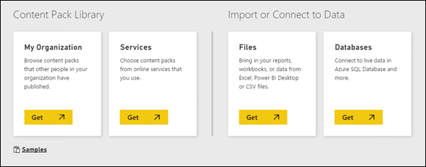

<properties 
   pageTitle="Get data for Power BI"
   description="Get data for Power BI"
   services="powerbi" 
   documentationCenter="" 
   authors="maggiesMSFT" 
   manager="mblythe" 
   editor=""
   tags=""/>
 
<tags
   ms.service="powerbi"
   ms.devlang="NA"
   ms.topic="article"
   ms.tgt_pltfrm="NA"
   ms.workload="powerbi"
   ms.date="09/28/2015"
   ms.author="maggies"/>
# Get data for Power BI

Dashboards, reports, and datasets are at the heart of Power BI. Connect to or import ***datasets*** from a variety of sources, including content packs, files and databases. Content packs provide "out of the box" connectivity to a number of popular software-as-a-service (SaaS) applications like Salesforce.

Need help understanding the building blocks that make up Power BI?  See [Power BI - Basic Concepts](powerbi-service-basic-concepts.md).

## Power BI data sources

Power BI is designed to work well with a variety of data sources:

-   Data from [Excel and Power BI Desktop files](powerbi-service-get-data-from-files.md).

-   [Organizational content packs](powerbi-service-organizational-content-packs-introduction.md), designed with dashboards, reports, and datasets specifically for your group or organization.

-   Content packs for [SaaS applications](https://support.powerbi.com/knowledgebase/topics/88770), if you have an existing subscription to that application. In addition to establishing a data connection, Power BI  provides pre-built dashboards and reports for each of these applications.

-   Connectors to [databases and other datasets](https://support.powerbi.com/knowledgebase/topics/88773), such as [Azure SQL Database](powerbi-azure-sql-database-with-direct-connect.md) and SQL Server [Analysis Services tabular data](powerbi-sql-server-analysis-services-tabular-data.md).

**Tip**: Read [Important considerations for connecting to data.](powerbi-service-important-considerations-for-connecting-to-data-in-power-bi.md)

## How to get data

How you get data depends on the kind of data you're getting.

-   Starting from the dashboard to which you want to add the workbook data, select Get Data at the bottom of the left navigation pane. 

    

-   Take your pick of data sources: organizational or SaaS content packs, files, databases, and samples.

    

## Now that you've got your data in Power BI

After you've connected to or imported a dataset, it's time to: 

-   [Explore the dataset](powerbi-service-explore-a-dataset.md) 

-   [View and create reports](powerbi-service-reports.md) 

-   [Add the most important information to your dashboard](powerbi-service-dashboards.md) 

-   [Use Q&A to ask questions on your dataset](powerbi-service-q-and-a.md) 

-   And more.

## See Also:

[Sample](powerbi-sample-datasets.md)[datasets](powerbi-sample-datasets.md)

[Get Started with Power BI](powerbi-service-get-started.md)

[Power BI - Basic Concepts](powerbi-service-basic-concepts.md)

