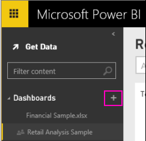
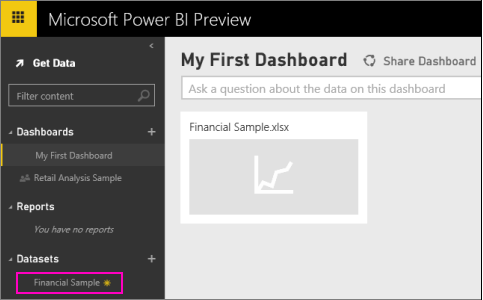
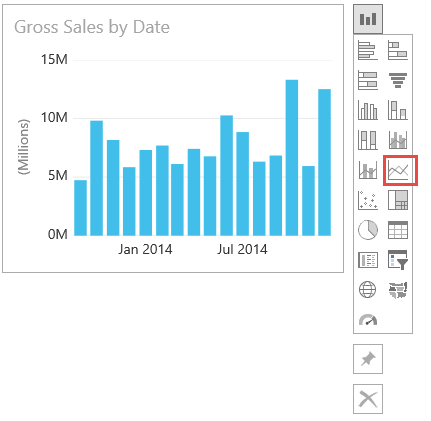
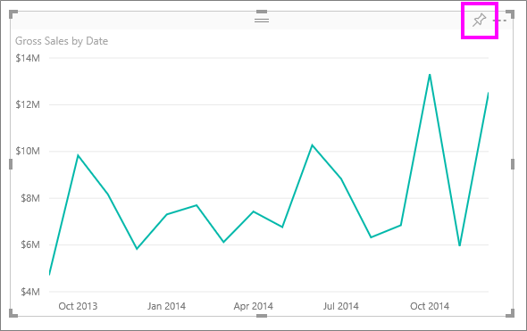
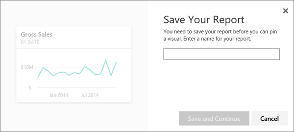

<properties 
   pageTitle="Get started with Power BI" 
   description="Get started with Power BI" 
   services="powerbi" 
   documentationCenter="" 
   authors="v-anpasi" 
   manager="mblythe" 
   editor=""
   tags=""/>
 
<tags
   ms.service="powerbi"
   ms.devlang="NA"
   ms.topic="article"
   ms.tgt_pltfrm="NA"
   ms.workload="powerbi"
   ms.date=""
   ms.author="v-anpasi"/>

#Get started with Power BI
[← Getting Started](https://support.powerbi.com/knowledgebase/topics/63037-getting-started)

Microsoft Power BI helps you stay up to date with the information that matters to you.  With Power BI, ***dashboards*** help you keep a finger on the pulse of your business.  Your dashboards display ***tiles*** that you can click to explore further with ***reports***.  Connect to multiple ***datasets*** to bring all of the relevant data together in one place.

Need help understanding the building blocks that make up Power BI?  See [Power Bi - Basic Concepts](http://support.powerbi.com/knowledgebase/articles/487029-power-bi-preview-basic-concepts). 

**Note:** This article is about the new Power BI experience, rather than the current experience, Power BI for Office 365. Read more about [which Power BI experience is right for me](https://support.powerbi.com/knowledgebase/articles/492388).
Prefer to watch instead of read?  Watch our getting started video:

<iframe width="500" height="281" frameborder="0" data-embed-url="https://www.youtube.com/watch?v=UE001nxTKqg" allowfullscreen="" scrolling="no" src="https://cdn.embedly.com/widgets/media.html?src=https%3A%2F%2Fwww.youtube.com%2Fembed%2FUE001nxTKqg%3Fwmode%3Dtransparent%26feature%3Doembed&amp;wmode=transparent&amp;url=https%3A%2F%2Fwww.youtube.com%2Fwatch%3Fv%3DUE001nxTKqg&amp;image=https%3A%2F%2Fi.ytimg.com%2Fvi%2FUE001nxTKqg%2Fhqdefault.jpg&amp;key=92cb8bc08566453cb1d8d02838cb7b06&amp;type=text%2Fhtml&amp;schema=youtube" class="embedly-embed"></iframe> 

##Step 1: Get data

[Sign in to Power BI](http://www.powerbi.com/). Don’t have an account? You can try out the [new Power BI for free](http://www.powerbi.com/ "try out the new Power BI for free").

** If you have important data in an Excel spreadsheet on your computer, you can create a Power BI dashboard to stay informed anywhere and share with others.  Are you a Salesforce user?  Get a head start by [connecting to Salesforce](http://support.powerbi.com/knowledgebase/articles/424863) to automatically create a dashboard from that data.

1.  Click the **plus sign  ** next to Dashboards to create a new dashboard.  

    
2.  Give your dashboard a name and press Enter to create it.
    
3.  Click the **Get data **icon.  

     
4.  ****The default option is to get data from an Excel spreadsheet.  Click **Connect** to continue.

5.  Click **Browse** to find the Excel spreadsheet that contains the data you want on your dashboard, then click OK.

    *Want to continue this tutorial with sample data? [Download this sample Excel spreadsheet](http://go.microsoft.com/fwlink/?LinkID=521962).*

    
    
6.  Once you've selected your spreadsheet, click **Connect**.
7.  Your new dataset appears in the navigation pane.

    
    

##Step 2: Explore your dataset

Now that you have connected to data, explore to find insights.  When you've found something you want to monitor, you can create a dashboard to keep up-to-date with changes.

1.  Click the dataset image on the dashboard to explore the data you just connected to.
    
    
2.  Click Got it to close the tip about creating your first chart.
3.  In the Fields list on the right side of the page, select fields to build a visualization.  Click the checkbox beside **Gross Sales** and then **Date**.

    
    
4.  Click the change visualization type button  to switch to a different way of displaying your data. Try changing to a line chart by clicking the line chart option.

	
5.  When you have a visualization you want on your dashboard, select the visualization and click the **Pin** button. When you pin a visualization, it will be stored on your dashboard so you can track the latest value at a glance.

    
    
6.  Because this is a new report, you need to save it before you can pin a visualization from it to the dashboard, as a tile. 

    
    
7.  Give your report a name and click **Save**. Power BI pins the visualization at the same time.
8.  Click the Power BI button  in the top-left corner of your browser window to go back to your dashboard. 

9.  Back on your dashboard, you can see your new visualization. Make your dashboard look even better by [renaming, resizing, and repositioning tiles](http://support.powerbi.com/knowledgebase/articles/424878).

    
    
    You can click the new tile on your dashboard to go back to the report anytime.
    
10. For a quick exploration of your data, try asking a question in the Q&A box.  For example, try typing "**what segment had the most revenue**".

    
11. Click the pin icon  to show this visualization on your dashboard too.
12. Click the back arrow  to go back to your dashboard.

In a few minutes, you've created an interactive dashboard.

Ready to try more?  Here are some great ways to explore more of Power BI.

-   [Connect to another dataset](https://powerbi.uservoice.com/knowledgebase/articles/434354).
-   [Share your dashboard](http://support.powerbi.com/knowledgebase/articles/431008-share-a-dashboard) with your coworkers.
-   Read [tips for designing dashboards](http://support.powerbi.com/knowledgebase/articles/433616-tips-for-designing-a-great-dashboard).

Not quite ready to jump right in? Start with these topics designed to help you feel comfortable with Power BI.

-   [Power BI videos](http://support.powerbi.com/knowledgebase/articles/475702-power-bi-preview-videos)
-   [Learn how reports, datasets, dashboards, and tiles all fit together](http://support.powerbi.com/knowledgebase/articles/487029-power-bi-preview-basic-concepts)
-   [See what samples we have available for you to use](http://support.powerbi.com/knowledgebase/articles/471112-sample-datasets)

### Stay in touch with Power BI

-   Follow [@MSPowerBI on Twitter](https://twitter.com/mspowerbi)
-   Sign up for the [Power BI Newsletter](http://www.microsoft.com/en-us/powerBI/newsletter.aspx)
-   Watch our [Power BI Getting Started webinars](http://www.microsoft.com/en-us/powerBI/webinars.aspx) on demand