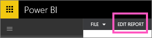
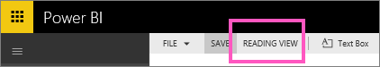

<properties 
   pageTitle="Go from Reading View to Editing View in Power BI"
   description="Go from Reading View to Editing View in Power BI"
   services="powerbi" 
   documentationCenter="" 
   authors="mihart" 
   manager="mblythe" 
   editor=""
   tags=""/>
 
<tags
   ms.service="powerbi"
   ms.devlang="NA"
   ms.topic="article"
   ms.tgt_pltfrm="NA"
   ms.workload="powerbi"
   ms.date="10/14/2015"
   ms.author="mihart"/>
# Go from Reading View to Editing View in Power BI

In Editing View in Power BI (compared to [Reading View](powerbi-service-interact-with-a-report-in-reading-view.md)) you can dig even deeper into your data by adding and removing fields, changing visualization type, creating new visualizations, and adding and deleting visualizations and pages from the report.  To edit a report, you must be the owner of the report.

1.  In Reading View, select **Edit Report**. 

    

    The report is now in Editing View and uses the same [display settings](powerbi-service-change-report-display-settings.md) you last used in Reading View.

2. To return to **Reading View**, select Reading View from the top navigation bar. 
    
	

There are so many ways to [edit your report](powerbi-service-interact-with-a-report-in-editing-view.md), slicing and dicing your data to discover insights and get answers to questions.  The next topic, [Interact with a report in Editing View](powerbi-service-interact-with-a-report-in-editing-view.md), lists and describes these in detail.

## See Also:

Read more about [reports in Power BI](powerbi-service-reports.md)

[Get started with Power BI](powerbi-service-get-started.md)

[Power BI - Basic Concepts](powerbi-service-basic-concepts.md)  

