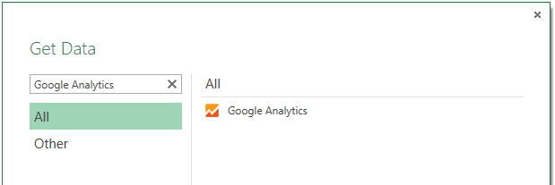

<properties pageTitle="3rd Party Service - Google Analytics Connector" description="3rd Party Service - Google Analytics Connector" services="powerbi" documentationCenter="" authors="v-anpasi" manager="mblythe" editor=""/>
<tags ms.service="powerbi" ms.devlang="NA" ms.topic="article" ms.tgt_pltfrm="NA" ms.workload="powerbi" ms.date="06/26/2015" ms.author="v-anpasi"/>
# Third-party service: Google Analytics connector for Power BI Designer

[← Power BI Designer](https://support.powerbi.com/knowledgebase/topics/68530-power-bi-designer)

The Google Analytics content pack and the connector in the Power BI Designer rely on the Google Analytics Core Reporting API. As such, features and availability may vary over time.

### Update 6/3

The issue we were experiencing while connecting to Google Analytics has been resolved. If you were encountering any issues logging in to Google Analytics through Power BI or refreshing Google Analytics datasets, please try again.

### Changes to the API

Although we attempt to release updates in accordance with any changes, the API may change in a way that affects the results of the queries we generate. In some cases, certain queries may no longer be supported. Due to this dependency we cannot guarantee the results of your queries when using this connector.

More details on changes to the Google Analytics API can be found in their [changelog](https://developers.google.com/analytics/devguides/changelog).

