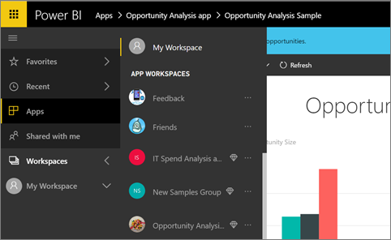

<properties
   pageTitle="How should I collaborate and share dashboards and reports?"
   description="In Power BI you can collaborate on and share dashboards, reports, and tiles in several different ways. Each has its advantages."
   services="powerbi"
   documentationCenter=""
   authors="maggiesMSFT"
   manager="erikre"
   backup="ajayan"
   editor=""
   tags=""
   qualityFocus="monitoring"
   qualityDate="02/28/2017"/>

<tags
   ms.service="powerbi"
   ms.devlang="NA"
   ms.topic="article"
   ms.tgt_pltfrm="NA"
   ms.workload="powerbi"
   ms.date="05/26/2017"
   ms.author="maggies"/>

# How should I collaborate and share dashboards and reports?  

You create dashboards and reports. Maybe you collaborate on them with your colleagues, too. Then you want others to have access to them. What's the best way to distribute them?

In this article, we'll talk about options for collaborating and sharing in Power BI: 

- Collaborating with colleagues to create meaningful reports and dashboards in *app workspaces*.
- Bundling those dashboards and reports into *apps* and distributing them to a larger group or your whole organization.
- *Sharing* dashboards with a few people, from the service or the Power BI mobile apps.
- *Publishing to the web*, where anyone can interact with them.
- Printing. 

This article compares these and other activities.

*Apps in the Power BI service*

> [AZURE.NOTE] In most cases, the people you collaborate and share with need [Power BI free or Pro](https://powerbi.microsoft.com/pricing/) licenses before they can see your dashboards and reports. 

## Collaborate with colleagues to create an app

Say you and your teammates want to distribute your Power BI insights to your organization. The best way to do that is to create an *app*. An app is a collection of dashboards and reports built for your organization, to deliver key metrics. 

To create an app, you need a *app workspace*, with your teammates as members. Think of the app workspace as a staging area where you and they can collaborate on your Power BI dashboards and reports. All of you can create reports in Power BI Desktop and publish those reports to the app workspace, and all of you need Power BI Pro licenses.

**If you just want to share a finished dashboard with colleagues, don't add those colleagues to the app workspace.** Instead, [create the dashboard in an app workspace](powerbi-service-create-apps.md), and distribute the app to them. 

## Distribute your app to a broad audience

Say you want to distribute your dashboard to a broad audience. You and your colleagues have created an *app workspace*, then created and refined dashboards, reports, and datasets in the app workspace. Now you bundle them together as an app and distribute it &#151; either to members of a security group or distribution list, or to your whole organization. 

Apps are easy to find and install in the Power BI service ([https://powerbi.com](https://powerbi.com)). You can send your business users a direct link to the app, or they can search for it in AppSource. Read more about [distributing your apps](powerbi-service-create-apps.md#distribute-an-app). 

After they install an app, they can view it in their browser or mobile device.

For your users to view your app, either they need to have a Power BI Pro license, too, or the app needs to be stored in a Power BI Premium capacity. Read [What is Power BI Premium](https://aka.ms/changethislink) for details.

## Share a dashboard
Let's say you've finalized a dashboard in your own My Workspace or in an app workspace and you want some other people to have access to it. One way to get it to them is to *share* it. 

You need a Power BI Pro license to share your dashboard, and those you share it with do, too. When you share a dashboard, they can view it and interact with it, but can't edit it. They see the same data that you see in the dashboard and reports unless row-level security (RLS) is applied to the underlying dataset. The colleagues you share it with can share the dashboard with their colleagues, if you allow them to. 

You can share with people outside your organization, too. They can view and interact with the dashboard too, but can't share it. 

More about [sharing a dashboard from the Power BI service](powerbi-service-share-unshare-dashboard.md).

## Annotate and share from the Power BI mobile apps
In the Power BI mobile apps for iOS and Android devices, you can annotate a tile, report, or visual and then share it with anyone via email. 

You're sharing a snapshot of the tile, report, or visual, and your recipients see it exactly as it was when you sent the mail. The mail also contains a link to the dashboard or report. If they have a Power BI Pro license and you've shared the object with them already, they can open it. You can send snapshots of tiles to anyone &#151; not just colleagues in the same email domain.

More about [annotating and sharing tiles, reports, and visuals](powerbi-mobile-annotate-and-share-a-tile-from-the-iphone-app.md) from the iOS and Android mobile apps.

You can also share a snapshot of a tile from the [Power BI app for Windows 10 devices](powerbi-mobile-annotate-and-share-a-snapshot-from-the-windows-app.md).

## Publish to the web

You can publish Power BI reports to the whole Internet by embedding interactive visualizations in blog posts, websites, social media, and other online communications on any device. Anyone on the Internet can view your reports, and you have no control over who can see what you've published. They don't need a Power BI license. Publishing to the web is available only for reports that you can edit. You can't publish reports to the web if they're shared with you or if they're in an app. More about [publishing to the web](powerbi-service-publish-to-web.md).

## Print or save as PDF or other static file

You can print or save as PDF (or other static file format) an entire dashboard, dashboard tile, report page, or visualization from the Power BI service. Reports can only be printed one page at a time -- you can't print the entire report at once. More about [printing or saving as a static file](powerbi-service-print.md).

## Next steps
-   [Share a dashboard with colleagues](powerbi-service-share-unshare-dashboard.md)
-   [Create and distribute an app in Power BI](powerbi-service-create-apps.md)
-   More questions? [Try the Power BI Community](http://community.powerbi.com/).

