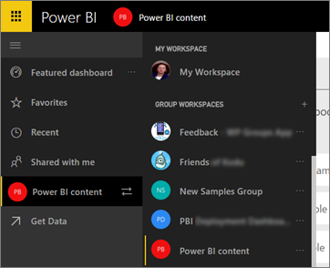
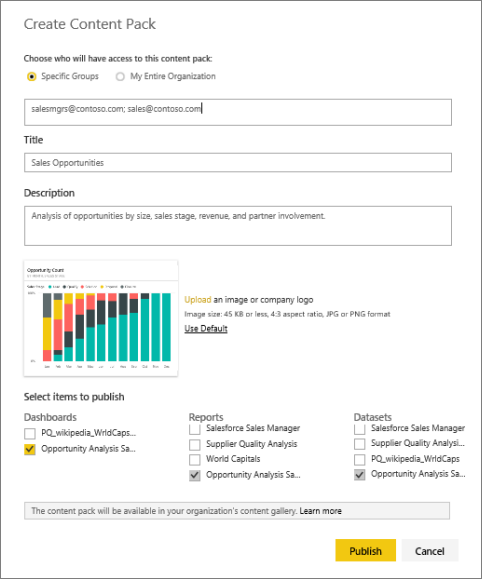

<properties
   pageTitle="How should I collaborate on & share dashboards and reports?"
   description="In Power BI you can collaborate on and share dashboards, reports, and tiles in several different ways. Each has its advantages."
   services="powerbi"
   documentationCenter=""
   authors="ajayan"
   manager="erikre"
   backup="maggiesMSFT"
   editor=""
   tags=""
   qualityFocus="monitoring"
   qualityDate="02/28/2017"/>

<tags
   ms.service="powerbi"
   ms.devlang="NA"
   ms.topic="article"
   ms.tgt_pltfrm="NA"
   ms.workload="powerbi"
   ms.date="02/28/2017"
   ms.author="ajayan"/>

# How should I collaborate on & share dashboards and reports?  

In this article, we'll talk about collaborating and sharing in Power BI as a process. First, when you want to collaborate with your colleagues to create meaningful reports and dashboards, you save them to a *group workspace*. 

*Group workspaces in the Power BI service*

When the reports and dashboards are ready, if you want other people to access them you have options for how to do that. For example:

- You can *share* them, either from the Power BI service or from one of the Power BI mobile apps. 
- You can bundle them into an *organizational content pack* and publish them to a large group or to your whole organization. 
- You can even publish them to the web, where anyone can interact with them. 

This article compares these and other activities.

> [AZURE.NOTE] In most cases, the people you collaborate and share with need [Power BI free or Pro](https://powerbi.microsoft.com/) licenses before they can see your dashboards and reports. 

## Collaborate on dashboards and reports in a group workspace 
Say you and your teammates want to create and edit dashboards and reports together. In that case, you need a *group workspace*, with your teammates as members. Think of the group workspace as a place where you and they can collaborate on your Power BI dashboards and reports. All of you can also create reports in Power BI Desktop and publish those reports to the group workspace. Group workspaces in Power BI are built on Office 365 groups, so you can save Excel workbooks and other files to the workspace, too. You can give everyone in the group the same permissions, or you can give some members just read-only permissions. 

**If you just want to share a finished dashboard with colleagues, don't add those colleagues to the group workspace.** 

Instead, [share the dashboard](powerbi-service-how-should-i-share-my-dashboard.md#share-a-dashboard-with-others) with them, or [create an organizational content pack](powerbi-service-how-should-i-share-my-dashboard.md#create-an-organizational-content-pack-and-publish-it) and publish it. You can't add security groups to Power BI group workspaces, so you have to manage individual users. By sharing dashboards or creating organizational content packs instead, you can distribute to Active Directory security groups, or to your entire organization.

Everyone in your Power BI group workspace needs a Power BI Pro license. More about [group workspaces in Power BI](powerbi-service-create-a-group-in-power-bi.md).

## Share a dashboard with others 
Let's say you've finalized a dashboard in your own My Workspace or in a group workspace and you want others have access to it. One way to get it to them is to *share* it. Sharing has a specific meaning in Power BI. 

When you share a dashboard, those you share it with can view it and interact with it, but can't edit it. They see the same data that you see in the dashboard and reports unless row-level security (RLS) is applied to the underlying dataset. The colleagues you share it with can share the dashboard with their colleagues, if you allow them to. 

You can share dashboards to Active Directory security groups, or to your entire organization, and you can share with people outside your organization. They can view and interact with the dashboard too, but can't share it. More about [sharing a dashboard from the Power BI service](powerbi-service-share-unshare-dashboard.md).

You can also [share a dashboard from any of the Power BI mobile apps](powerbi-mobile-share-a-dashboard-from-the-iphone-app.md). 

### Share a dashboard with colleagues outside a group workspace 
If you're part of a group workspace in Power BI, you can share the group's dashboards with colleagues outside the group. It's the same as [sharing a dashboard with colleagues](powerbi-service-share-unshare-dashboard.md).

## Create an organizational content pack and publish it  
Another way to distribute your Power BI insights with your colleagues is to create an *organizational content pack*. You've created and refined a dashboard with its reports and datasets, either in your own My Workspace or in a group workspace. Now you bundle them together as a content pack and distribute them &#151; either to members of an Active Directory security group or distribution list, or to your whole organization. 

When those colleagues go to the Content Pack Library for your organization, they see your content pack along with any others that have been distributed to them. More about [organizational content packs](powerbi-service-organizational-content-packs-introduction.md).  

## Annotate and share from the Power BI mobile apps
In the Power BI mobile apps for iOS and Android devices, you can annotate a tile, report, or visual and then share it with anyone via email. 

You're sharing a snapshot of the tile, report, or visual, and your recipients see it exactly as it was when you sent the mail. The mail also contains a link to the dashboard or report, and if you've shared that with them already, they can open it. You can send snapshots of tiles to anyone &#151; not just colleagues in the same email domain.

More about [annotating and sharing tiles, reports, and visuals](powerbi-mobile-annotate-and-share-a-tile-from-the-iphone-app.md) from the iOS and Android mobile apps.

You can also share a snapshot of a tile from the [Power BI app for Windows 10 devices](powerbi-mobile-annotate-and-share-a-snapshot-from-the-windows-app.md).

## Publish to the web

You can publish Power BI reports to the whole Internet by embedding interactive visualizations in blog posts, websites, social media, and other online communications on any device. Anyone on the Internet can view your reports, and you have no control over who can see what you've published. They don't need a Power BI license. Publishing to the web is available only for reports in your My Workspace that you can edit. If someone shares a report with you, you can't publish it to the web. More about [publishing to the web](powerbi-service-publish-to-web.md).

## Print or save as PDF or other static file

You can print or save as PDF (or other static file format) an entire dashboard, dashboard tile, report page, or visualization from the Power BI service. Reports can only be printed one page at a time -- you can't print the entire report at once. More about [printing or saving as a static file](powerbi-service-print.md).

## Table summarizing collaboration and sharing options

Here's a summary of how sharing and collaborating works, depending on which you do. Details follow below.

|        | When you: |  |  |  |  |  |
|:------------------------|:----------------------------|:----------------------------------------|:---------------------------------|:-----------------------------|:-----------------------------|:-----------------------------|
| Other people:         | Create a dashboard in a group | Share a dashboard | Publish a content pack | Publish to the web | Share a snapshot of a tile | Save as PDF |
| Can view and interact       | group members, yes   | yes                         | yes                              | yes                          | View, not interact | View, not interact |
| Can edit the original       | group members, yes  | no                          | no                               | no                           | no | no |
| Can create their own copies | group members, yes  | no                          | yes                              | no                           | yes | yes |
| Can share with others       | group members, yes  | colleagues, yes. others, no | no                               | no                           | yes | yes |
| Need a Power BI license       | Pro   | free or Pro | Pro  | none  | none | none |

## See also
-   [Share a dashboard with colleagues](powerbi-service-share-unshare-dashboard.md)
-   [Create a group in Power BI](powerbi-service-create-a-group-in-power-bi.md)
-   More questions? [Try the Power BI Community](http://community.powerbi.com/).

