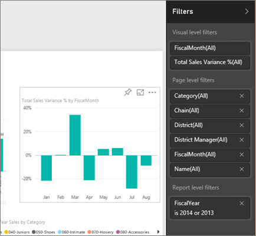

<properties
   pageTitle="How to use report filters"
   description="How to use report filters"
   services="powerbi"
   documentationCenter=""
   authors="mihart"
   manager="mblythe"
   backup=""
   editor=""
   tags=""
   qualityFocus="monitoring"
   qualityDate=""/>

<tags
   ms.service="powerbi"
   ms.devlang="NA"
   ms.topic="article"
   ms.tgt_pltfrm="NA"
   ms.workload="powerbi"
   ms.date="08/02/2016"
   ms.author="mihart"/>

# How to use report filters
This article explains how to use filters when you're creating or viewing a report.

There are many different ways to filter data in Power BI and we recommend reading [About filters and highlighting](powerbi-service-about-filters-and-highlighting-in-reports) first.

## Working with filters  
Reports can be opened in [Editing View](powerbi-service-go-from-reading-view-to-editing-view.md) or [Reading View](powerbi-service-open-a-report-in-reading-view.md). In Editing View, report owners can use the **Filters** pane to add filters to a report and those filters are saved with the report. People viewing the report in Reading View can interact with the filters, but cannot save filter changes to the report.

## Working with filters in Reading viewing
You can find the **Filters** pane in the top right corner.  If it's collapsed, just select the arrow to expand it.

In this example, we've selected a visual that has filters: FiscalMonth and Total Sales Variance.  The report page also has filters, listed under the **Page level filters** heading. And the entire report has a filter too:  FiscalYear is 2013 or 2014.  

Anyone viewing this report can interact with these filters.
-  view the details of the filter by hovering and selecting the arrow next to the filter.

-  change the filter, for example, xxxx.

-  delete the filter by selecting the **x** next to the filter name.

## Working with filters in Editing view

Filter controls are available in the bottom half of the **Visualization pane**:  

If no visual is selected in the canvas, then the Filters pane displays just the filters that apply to the entire report page and to the entire report (if any have been set). In the example below, no visual is selected and there are no page level filters but there is a report level filter.  
  

If a visual is selected in the canvas, you will also see the filters that apply to just that visual:  

To display options for a particular filter, select the down arrow next to the filter.  In the example below, the report level filter is set to 2013 and 2014. And this is an example of **basic filtering**.  To display the advanced options, select **Advanced Filtering**.

### Clear a filter  
 In either advanced or basic filtering mode, select the eraser icon  . 

### Types of filters: text field filters  
#### List mode  
Ticking a checkbox either selects or deselects the value. The **All** checkbox can be used to toggle the state of all checkboxes on or off. The checkboxes represent all the available values for that field.  As you adjust the filter, the restatement updates to reflect your choices. 

-   Note how the restatement now says "is Amarilla or Carretera"

#### Advanced mode  
Select **Advanced Filtering** to switch to advanced mode. Use the dropdown controls and text boxes to identify which fields to include. By choosing between **And** and **Or**, you can build complex filter expressions. Click the **Apply Filter** button when you've set the values you want.  

### Types of filters: numeric field filters  
#### List mode  
If the values are finite, selecting the field name displays a list.  See **Text field filters** &gt; **List mode** above for help using checkboxes.   

#### Advanced mode  
If the values are infinite or represent a range, selecting the field name opens the advanced filter mode. Use the dropdown and text boxes to specify a range of values that you want to see. 

By choosing between **And** and **Or**, you can build complex filter expressions. Select the **Apply Filter** button when you've set the values you want.

### Types of filters: date and time  
#### List mode  
If the values are finite, selecting the field name displays a list.  See **Text field filters** &gt; **List mode** above for help using checkboxes.   

#### Advanced mode  
If the field values represent date or time, you can specify a start/end time when using Date/Time filters.  

## See also  
[Filters and highlighting in reports](powerbi-service-about-filters-and-highlighting-in-reports.md)  
[Interact with filters and highlighting in report Reading View](powerbi-service-interact-with-a-report-in-reading-view.md)  
[Create filters in report Editing View](powerbi-service-add-a-filter-to-a-report.md)  
[Change how report visuals cross-filter and cross-highlight each other](powerbi-service-visual-interactions.md)
Read more about [reports in Power BI](powerbi-service-reports.md)  
[Power BI - Basic Concepts](powerbi-service-basic-concepts.md)
