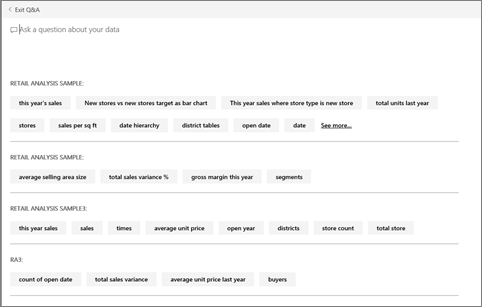

<properties
   pageTitle="How to use Power BI Q&A"
   description="How to use Power BI Q&A"
   services="powerbi"
   documentationCenter=""
   authors="mihart"
   manager="mblythe"
   backup=""
   editor=""
   tags=""
   featuredVideoId="qMf7OLJfCz8"
   qualityFocus="no"
   qualityDate=""/>

<tags
   ms.service="powerbi"
   ms.devlang="NA"
   ms.topic="article"
   ms.tgt_pltfrm="NA"
   ms.workload="powerbi"
   ms.date="08/23/2016"
   ms.author="mihart"/>

# How to use Power BI Q&A  

## Ask questions of your data using natural language  
The Q&A question box is where you type your question using natural language. Q&A recognizes the words you type and figures out where (which dataset) to find the answer. Q&A also helps you form your question with auto-completion, restatement, and other textual and visual aids.

The answer to your question is displayed as an interactive visualization and updates as you modify the question.

Q&A is interactive and even fun, and, more often than not, one question will lead to many others as the visualizations reveal interesting paths to pursue. Watch Amanda demonstrate using Q&A to create visuals, dig into those visuals, and pin them to dashboards.

<iframe width="560" height="315" src="https://www.youtube.com/embed/qMf7OLJfCz8?list=PL1N57mwBHtN0JFoKSR0n-tBkUJHeMP2cP" frameborder="0" allowfullscreen></iframe>

## Use natural language to ask questions about your data

1.  Place your cursor in the question box. Even before you start typing, Q&A displays a new screen with suggestions to help you form your question.

      

    This  list contains:  
    - the questions used to create [tiles ](powerbi-service-dashboard-tiles.md)that are already pinned to the dashboard, and  

    - the name of tables in the [underlying dataset(s)](powerbi-service-get-data.md).  

	You can always choose one of these questions as a starting point and continue to refine the question to find the specific answer you are looking for.  Or, use a table name to help you word a new question.

2.  Select from the dropdown or begin typing your own question.  
    

3.  As you type a question, Power BI Q&A picks the best [visualization ](powerbi-service-visualization-types-for-reports-and-q-and-a.md)to display your answer; and the visualization changes dynamically as you modify the question. Q&A also helps you formulate your question with auto-completion, by restating your question, and with other textual and visual aids.  
    

4.  When you type a query, Power BI looks for an answer in any dataset that has a tile on that dashboard.  If all the tiles are from *datasetA*, then your answer will come from *datasetA*.  If there are tiles from *datasetA *and *datasetB*, then Q&A will search for the best answer from those 2 datasets.

    The dataset(s) that is used to create the visualization is visible below the visualization.  

    >**Tip:** 
	>So be careful, if you only have one tile from *datasetA *and you remove it from your dashboard, Q&A will no longer have access to *datasetA*.

5.  When you're happy with the result, [pin the visualization to a dashboard](powerbi-service-pin-a-tile-to-a-dashboard-from-the-question-box.md) by selecting the pin icon in the top right corner.

    

## Tell Q&A which visualization to use.  
With Q&A, not only can you ask your data to speak for itself, you can tell it how you want it displayed. Just add "as a &lt;visualization type&gt;" to the end of your question.  For example, "show inventory volume by plant as a map" and "show total inventory as a card".  Try it for yourself.

## How does Q&A know how to answer questions?  
### Which datasets does Q&A use?

How does Q&A know how to answer data-specific questions? It relies on the names of the tables, columns, and calculated fields in the underlying dataset. So what you (or the dataset owner) call things is important! 

For example, suppose you had an Excel table named “Sales”, with columns titled “Product”, “Month”, “Units Sold”, “Gross Sales”, and “Profit”. You could ask questions about any of those entities.  You could ask "show *sales"*, "total *profit *by *month"*, "sort *products *by *units sold"*, and more.

Q&A can answer questions that are based on how your dataset is organized. How would this work for data in Salesforce? When you connect to your salesforce.com account, Power BI generates a dashboard automatically.  Before you start asking questions with Q&A, take a look at the data displayed in the dashboard visualizations and also at the data displayed in the Q&A dropdown.

-   If the visualizations' axis labels and values include "sales",  "account", "month", and “opportunities”, then you can confidently ask questions such as: “Which *account *has the highest *opportunity*”, or “show *sales *by month as a bar chart”.
 
-   If the dropdown includes "salesperson", "state", and "year", then you can confidently ask questions such as: "which *salesperson *had the lowest *sales *in *Florida* in *2013*."

If you have website performance data in Google Analytics, you could ask Q&A about time spent on a web page, number of unique page visits, and user engagement rates. Or, if you’re querying demographic data, you might ask questions about age and household income by location.

### Which visualization does Q&A use?  
Q&A picks the best visualization based on the data being displayed. Sometimes data in the underlying dataset(s) is defined as a certain type or category and this helps Q&A know how to display it. For example, if data is defined as a date type, it is more likely to be displayed as a line chart. Data that is categorized as a city is more likely to be displayed as a map.

You can also tell Q&A which visualization to use by adding it to your question. But keep in mind that it may not always be possible for Q&A to display the data in the visualization type you requested.

For information about keywords that Q&A recognizes, see [Tips for asking questions](powerbi-service-q-and-a-tips.md).

## See also  
Back to [Q&A in Power BI](powerbi-service-q-and-a.md)  
[Tutorial: Use Q&A with the Retail Sales sample](powerbi-service-tutorial-introduction-to-q-and-a.md)  
[Tips for asking questions in Q&A](powerbi-service-q-and-a-tips.md)  
[Prepare a workbook for Q&A](powerbi-service-make-your-data-work-well-with-q-and-a.md)  
[Pin a tile to the dashboard from Q&A](powerbi-service-pin-a-tile-to-a-dashboard-from-the-question-box.md)  
