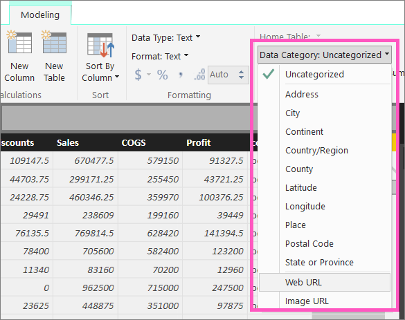
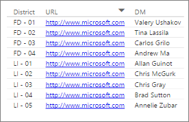
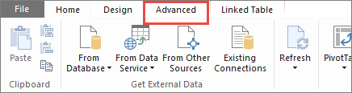

<properties
   pageTitle="Hyperlinks in tables"
   description="Hyperlinks in tables"
   services="powerbi"
   documentationCenter=""
   authors="mihart"
   manager="mblythe"
   backup=""
   editor=""
   tags=""
   qualityFocus="identified"
   qualityDate=""/>

<tags
   ms.service="powerbi"
   ms.devlang="NA"
   ms.topic="article"
   ms.tgt_pltfrm="NA"
   ms.workload="powerbi"
   ms.date="10/05/2016"
   ms.author="mihart"/>
# Hyperlinks in tables

This topic teaches you how to create and work with hyperlinks in tables and matrixes.  URLs in Power BI tables (and matrixes) can function as hyperlinks. Underlined text in a table or matrix that changes color as you hover over it, is a hyperlink.  Clicking on it will take you to the linked URL. 

>**NOTE**:
>Hyperlinks can also be added to [tiles on dashboards](powerbi-service-edit-a-tile-in-a-dashboard.md), [text boxes in reports](powerbi-service-add-a-hyperlink-to-a-text-box.md), and [text boxes on dashboards](powerbi-service-add-a-widget-to-a-dashboard.md).

## To create a hyperlink in Power BI table or matrix

Hyperlinks in tables and matrixes can be created in Power BI Desktop, but not from Power BI Service. Hyperlinks can also be created in Excel Power Pivot before the workbook is imported into Power BI. Both methods are described below.

## Create a table or matrix hyperlink in Power BI Desktop
The procedure for adding a hyperlink depends on whether you've imported the data or connected to it using DirectQuery. Both scenarios are described below.

### For data imported into Power BI  

1. If the hyperlink doesn't already exist as a field in your dataset, use Desktop to add it as a [custom column](powerbi-desktop-common-query-tasks.md).

2. Select the column and in the **Modeling** tab choose the dropdown for **Data Category**.

    

3. Select **Web URL**.

4. Switch to Report view and create a table or matrix using the field categorized as a Web URL. The hyperlinks will be blue and underlined.

    

4. [Publish the report from Desktop to Power BI service](powerbi-learning-4-1-publish-reports.md) and open the report in Power BI service. The hyperlinks will work there as well.

### For data connected with DirectQuery

You won't be able to create a new column in DirectQuery mode.  But if your data already contains URLs, you can turn those into hyperlinks.

2. In Report view, create a table using a field that contains URLs.

3. Select the column, and in the **Modeling** tab, choose the dropdown for **Data Category**.

3. Select **Web URL**. The hyperlinks will be blue and underlined.

4. [Publish the report from Desktop to Power BI service](powerbi-learning-4-1-publish-reports.md) and open the report in Power BI service. The hyperlinks will work there as well.

## Create a table or matrix hyperlink in Excel Power Pivot

1.  Open the workbook in Excel.

2.  Select the **PowerPivot** tab and then choose **Manage**.

    

3.  When Power Pivot opens, select the **Advanced **tab.

    

4.  Place your cursor in the column that contains the URLs that you'd like to turn into hyperlinks in Power BI tables.

    >**NOTE**: The URLS must start with either **http:// , https://** or **www**.

5.  In the **Reporting Properties** group, select the **Data Category** dropdown and choose **Web URL**. 

    

6.  From the Power BI service, connect to this workbook.

7.  Create a table visualization that includes the URL field.

    

## See also

[Visualizations in Power BI reports](powerbi-service-visualizations-for-reports.md)

[Power BI - Basic Concepts](powerbi-service-basic-concepts.md)

More questions? [Try the Power BI Community](http://community.powerbi.com/)
