<properties
   pageTitle="Quick Insights in Power BI"
   description="Documentation for viewing Quick Insights with Power BI service."
   services="powerbi"
   documentationCenter=""
   authors="mihart"
   manager="mblythe"
   backup=""
   editor=""
   tags=""
   featuredVideoId="SCUx47AFNhw"
   qualityFocus="no"
   qualityDate=""/>

<tags
   ms.service="powerbi"
   ms.devlang="NA"
   ms.topic="article"
   ms.tgt_pltfrm="NA"
   ms.workload="powerbi"
   ms.date="11/10/2016"
   ms.author="mihart"/>

# Quick Insights with Power BI

Have a new dataset and not quite sure where to start?  Need to build a dashboard fast?  Want to quickly look for insights you may have missed?

Run Quick Insights to generate interesting interactive visualizations based on your data. Quick Insights can be run [on a dataset](#run-quick-insights-on-a-dataset), [on a report](#run-quick-insights-on-a-report), and [on a dashboard tile](#run-quick-insights-on-a-dashboard-tile) (Scoped Insights).

>**NOTE**: Quick Insights is not available in Power BI Desktop and does not work with direct query - it only works with data uploaded to Power BI.

The Quick Insights feature is built on a growing [set of advanced analytical algorithms](powerbi-service-auto-insights-types.md) developed in conjunction with Microsoft Research that we’ll continue to use to allow more people to find insights in their data in new and intuitive ways.

## Run Quick Insights on a dataset

Let's explore Quick Insights using the Supplier Quality Analysis sample. To follow along, [connect to the sample datasets](powerbi-sample-datasets.md).

1. Start in the **Datasets** tab of your workspace, select the ellipses (...) for the dataset and choose **Get Insights**.

    

2. Power BI uses [various algorithms](powerbi-service-insights-types.md) to search for trends in your dataset.

    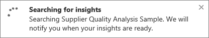

3. Within seconds, your insights are ready.  Select **View Insights** to display visualizations.

    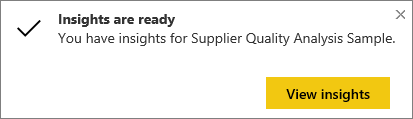

4. The visualizations display in a special **Quick Insights** canvas with up to 32 separate Insight cards. Each card has a chart or graph plus a short description.

    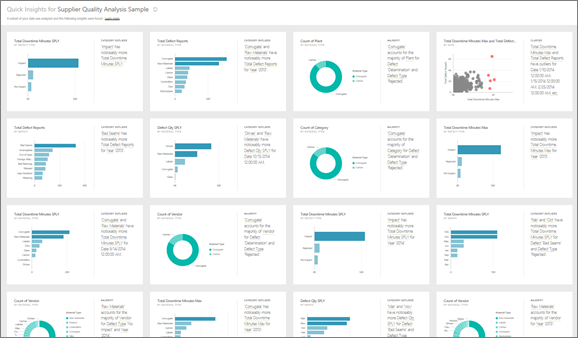

5.  If you find a particularly interesting insight, [pin it to a dashboard](powerbi-service-pin-a-tile-to-a-dashboard-from-a-report.md) by selecting the pin icon  from the top right corner.

6. Want to dig further?  Select the insight to display it full screen.

    

    And then select the Insights icon  from the top right corner to generate insights on the insight.  

7.  The Quick Insights are saved with the dataset so you can return to them at any time. Just open the **Datasets** tab, select the ellipses (...), and choose **View insights**.

    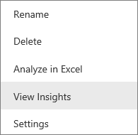

>**NOTE**: Some datasets can't generate Insights because the data isn't statistically significant.  To learn more, see [Optimize your data for Quick Insights](powerbi-service-auto-insights-optimize.md).

##  Run Quick Insights on a report
Let's continue to explore Quick Insights using the Opportunity Analysis sample.

1. In a workspace, open the **Reports** tab.

    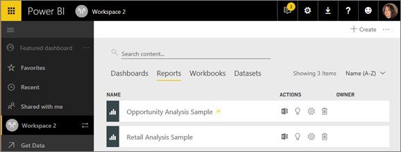

2. Select the Get Insights icon   .

3. Power BI uses [various algorithms](powerbi-service-auto-insights-types.md) to search for trends in your report.

    

4. Within seconds, your insights are ready.  Select **View Insights** to display visualizations.

    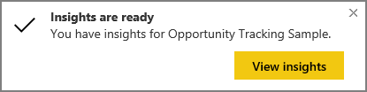

5.  The visualizations display in a special **Quick Insights** canvas with up to 32 separate Insight cards. Each card has a chart or graph plus a short description.

    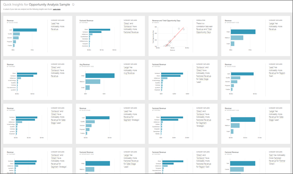

    >**NOTE**: Some reports can't generate Insights because the data in the underlying dataset isn't statistically significant.  To learn more, see [Optimize your data for Quick Insights](powerbi-service-auto-insights-optimize.md).

5. [Follow the steps in "Run Quick Insights on a dataset" above](#Run-quick-insights-on-a-dataset), starting at #5.

## Run Quick Insights on a dashboard tile
Instead of searching for insights against an entire dataset or report, narrow your search to the data used to create a single dashboard tile. This is referred to as **Scoped Quick Insights**.

1. [Open the tile in Focus mode](/powerbi-service-display-dash-in-focus-mode.md).

2. In the top right corner, select **Get Insights**.

    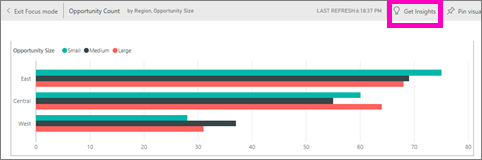

3. Power BI displays the insights along the right side of the tile.

    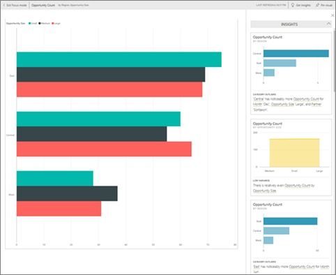

4. Does one insight pique your interest? Dig down even more by selecting that insight to see insights based on this insight.  

    

    The insight displays on the left and new insights, based solely on the data in that single insight, display along the right.

5. Continue digging into your data, and when you find an interesting insight, pin its visual to your dashboard by selecting **Pin visual** from the top-right corner. Also, you can send feedback to let the dataset owner know if a particular insight was helpful or not.

    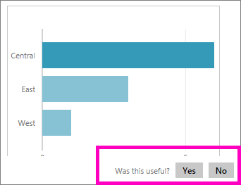

    Dataset owners can use the feedback to improve insights returned.

## Tips for interacting with the Insight cards

1. Hover over a card and select:

        - the pin icon to add the visualization to a dashboard.

        - the Focus icon to display the card full screen.

2. In Focus mode you can [filter](powerbi-service-interact-with-a-report-in-reading-view.md) the visualizations.  To display the filters, near the top-right corner, select the arrow above the word **Filters**.

    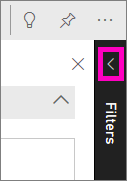

    The selections you make will filter the Insight card on the left side of the canvas.

3. Export the data as a .csv file. With Insights displayed, select the ellipses (...) from the top-right corner and choose **Export data**.

   

   Only the data for the main Insight card displayed will be exported.

## See also
[Power BI - Basic Concepts](powerbi-service-basic-concepts.md)

More questions? [Try the Power BI Community](http://community.powerbi.com/)
