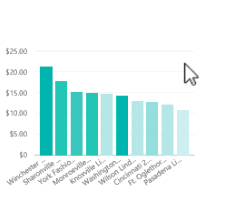
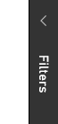
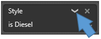

<properties
   pageTitle="Interact with a report in Reading View in Power BI"
   description="Interact with a report in Reading View in Power BI"
   services="powerbi"
   documentationCenter=""
   authors="mihart"
   manager="mblythe"
   backup=""
   editor=""
   tags=""
   qualityFocus="no"
   qualityDate=""/>

<tags
   ms.service="powerbi"
   ms.devlang="NA"
   ms.topic="article"
   ms.tgt_pltfrm="NA"
   ms.workload="powerbi"
   ms.date="06/20/2016"
   ms.author="mihart"/>

# Interact with a report in Reading View in Power BI

Reading view is not as interactive as Editing view, but it still gives you many options for exploring the data. Which comes in useful when viewing reports [shared with you](powerbi-service-share-unshare-dashboard.md), since these can only be opened in Reading View.

In Reading View you can cross-highlight and cross-filter visuals on a page.  Simply highlight or select  a value in one visual and instantly see its impact on the other visuals. Use the Filter pane to add and modify filters on a report page, and change the way values are sorted in a visualization. Reading view is a fun and safe way to play with and get to know your data.

**Cross-highlight the related visualizations on a page**

The visualizations on a single report page are all "connected" to each other.  What this means is that if you select one or more values in one visualization, other visualizations will change based on that selection.

>**NOTE**: To select more than one element in a visualization, hold down the CTRL key.

**Hover over visual elements to see the details**.

**Sort the data in a visualization**  

Select the ellipses (...) to open **Sort by**. Select the dropdown arrow to choose which field to sort by or select the AZ icon to switch between ascending and descending.    

 

**Interact with filters**

If the report author added filters to a page in a report, you can interact with them in Reading View. Changes you make will not be saved with the report.

1.  Select the Filter icon in the upper-right corner.

      

2.  You'll see all filters that have been applied to the visual you have selected (Visual level filters), across the whole report page (Page level filters), and across the entire report (Report level filters).

    

3.  Hover over a filter and expand it by selecting the down arrow.

    

4.  Make changes to the filters and see how the visuals are impacted.

**Zoom in on individual visuals**

Hover over a visual and select the **Focus mode** icon . When you view a visualization in Focus mode, it expands to fill the entire report canvas.

For more information, see [Add a filter to a report](powerbi-service-add-a-filter-to-a-report.md) and [About filters and highlighting in reports](powerbi-service-about-filters-and-highlighting-in-reports.md).

**Adjust the display dimensions**  
Reports are viewed on many different devices, with varying screen sizes and aspect ratios.  The default rendering may not be what you want to see on your device.  To adjust, select **View** and choose:

 - Fit to Page: scale content to best fit the page
 - Fit to Width: scale content to the width of the page
 - Actual Size: display content at full size  

  In Reading View, the display option you select is temporary - it is not saved when you close the report.

  For more information: [Tutorial: Change display settings in a report](powerbi-service-tutorial-change-report-display-settings.md).

## See also

[Reports in Power BI](powerbi-service-reports.md)

[About filters and highlighting in Power BI reports](powerbi-service-about-filters-and-highlighting-in-reports.md)
