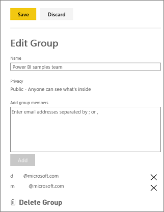
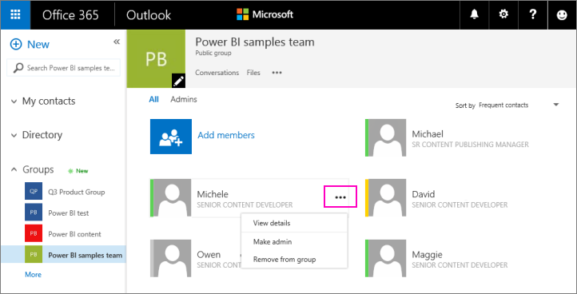
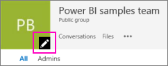
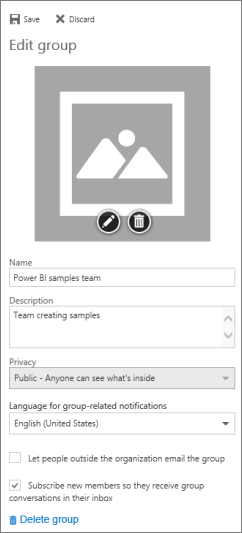
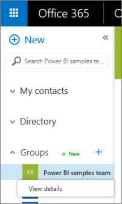

<properties 
   pageTitle="Manage your group in Power BI and Office 365"
   description="Manage your group in Power BI and Office 365"
   services="powerbi" 
   documentationCenter="" 
   authors="maggiesMSFT" 
   manager="mblythe" 
   editor=""
   tags=""/>
 
<tags
   ms.service="powerbi"
   ms.devlang="NA"
   ms.topic="article"
   ms.tgt_pltfrm="NA"
   ms.workload="powerbi"
   ms.date="10/14/2015"
   ms.author="maggies"/>
# Manage your group in Power BI and Office 365

As creator or admin of a group in Power BI or in Office 365, you manage some aspects of your group in Power BI. Other aspects you manage in Office 365. 

>NOTE: Groups are only available with [Power BI Pro](powerbi-power-bi-pro-content-what-is-it.md).

In Power BI you can:

-   Add or remove a group member, including making a group member an admin.
-   Edit the group name.
-   Make it so group members can only read and not edit content in the group.
-   Delete the group.

In Office 365 you can:

-   Add or remove members, including making a member an admin.
-   Edit the group name and description.
-   See the group email address.

## Edit your group in Power BI

1.  In Power BI, switch to the group’s workspace, so the group name is in the top-left corner.  

    

2.  Select the ellipsis (**…**) next to your group name \> **Edit Group**.

    

    >**NOTE**: You only see **Edit Group** if you’re a group admin.

3.  Add or remove members, rename, or delete the group. 

    

## Edit Power BI group properties in Office 365 

1.  In Power BI, switch to the group’s workspace, so the group name is in the top-left corner. 

    

2.  Select the ellipsis (**…**) next to your group name \> **Members**.

    

    This opens the Outlook for Office 365 view of your group.

3.  Tap the ellipsis (**…**) next to a member's name to make the member an admin, or delete the member from the group. 

    

## Add an image and set other group properties in Office 365

1.  In the Outlook for Office 365 view of your group, select the pencil icon to edit group properties.

    

2.  You can edit the name, description, and language, add an image, and set other properties here.

    

3.  Select **Save** or **Discard**.

## Find the email address for your group

When you create an [organizational content pack](powerbi-service-organizational-content-packs-introduction.md), you can distribute it to your whole organization or to specific people or groups. With the email address for the group, you can easily distribute it to all the members of your group. 

1.  In the Outlook for Office 365 view of your group, under **Groups** in the left navigation pane, right-click the group name \> **View details**.

    

2.  You’ll see the email address under **Send email**. It has this format:

    *yourgroupID*@service.microsoft.com. 

More about [groups in Power BI](powerbi-service-groups.md).

