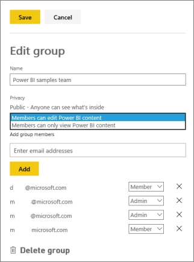

<properties 
   pageTitle="Manage your app workspace in Power BI and Office 365"
   description="App workspaces in Power BI are a collaborative experience built on Office 365 groups. Manage your app workspaces in Power BI and also in Office 365."
   services="powerbi" 
   documentationCenter="" 
   authors="ajayan" 
   manager="erikre" 
   backup="maggiesMSFT"
   editor=""
   tags=""
   qualityFocus="no"
   qualityDate=""/>
 
<tags
   ms.service="powerbi"
   ms.devlang="NA"
   ms.topic="article"
   ms.tgt_pltfrm="NA"
   ms.workload="powerbi"
   ms.date="05/02/2017"
   ms.author="ajayan"/>
# Manage your app workspace in Power BI and Office 365

> [AZURE.NOTE] Have you heard about the new *apps* yet? Apps are the new way to distribute content to large audiences in Power BI. You create apps in *app workspaces*, which replace groups and group workspaces. We recommend using apps instead of organizational content packs or read-only workspaces. Learn [more about apps](powerbi-service-what-are-apps.md).

As creator or admin of a app workspace in Power BI or in Office 365, you manage some aspects of your app workspace in Power BI. Other aspects you manage in Office 365. 

> [AZURE.NOTE] App workspaces are only available with [Power BI Pro](powerbi-power-bi-pro-content-what-is-it.md).

**In Power BI** you can:

-   Add or remove app workspace members, including making a workspace member an admin.
-   Edit the app workspace name.
-   Delete the app workspace.

**In Office 365** you can:

-   Add or remove group members, including making a member an admin.
-   Edit the group name, image, description, and other settings.
-   See the group email address.
-   Delete the group.

## Edit your app workspace in Power BI

1.  In Power BI, switch to the app workspace, so the app workspace name is in the top-left corner.  

    

2.  Select the ellipsis (**…**) next to your app workspace name \> **Edit workspace**.

    

    > [AZURE.NOTE] You only see **Edit workspace** if you’re an app workspace admin.

3.  Here you can add or remove members, rename, or delete the app workspace. 

    

4.  Select **Save** or **Cancel**.

## Edit Power BI app workspace properties in Office 365 

1.  In Power BI, switch to the app workspace, so the app workspace name is in the top-left corner. 

    

2.  Select the ellipsis (**…**) next to your app workspace name \> **Members**.

    

    You may need to sign into your corporate account.

    This opens the Outlook for Office 365 group view of your app workspace.

3.  Tap the ellipsis (**…**) next to a member's name to make the member an admin, or delete the member from the app workspace. 

    

## Add an image and set other group workspace properties in Office 365

1.  In the Outlook for Office 365 view of your group workspace, select the group workspace image to edit group workspace properties.

    

2.  You can edit the name, description, and language, add an image, and set other properties here.

    

3.  Select **Save** or **Discard**.

## Find the email address for your app workspace

When you create an [organizational content pack](powerbi-service-organizational-content-packs-introduction.md), you can give your whole organization access to it, or just specific people or groups. With the email address for the app workspace, you can easily give all the members of your app workspace access to your content pack. 

1.  In the Outlook for Office 365 view of your group app workspace, under **Groups** in the left navigation pane, right-click the group app workspace name \> **Copy email address**.

    

2.  You see the email address has this format:

    *yourgroupID*@service.microsoft.com. 

3.  Now when you create an [organizational content pack](powerbi-service-organizational-content-packs-introduction.md), select **Specific groups** and paste your group's email address in the box.  

    When the group members go to **Get Data** > **My organization**, they'll find your content pack there.

## Next steps

- [Create apps and app workspaces in Power BI](powerbi-service-create-apps.md)
- More questions? [Try the Power BI Community](http://community.powerbi.com/)
