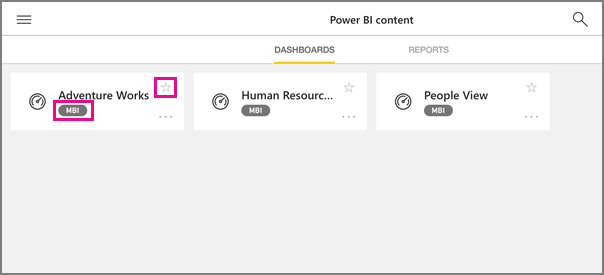

<properties 
   pageTitle="Groups in the iPad app"
   description="Power BI groups are built on Office 365 groups. Read about viewing and interacting with group dashboards in the Power BI iOS mobile app for the iPad."
   services="powerbi" 
   documentationCenter="" 
   authors="maggiesMSFT" 
   manager="mblythe" 
   backup=""
   editor=""
   tags=""
   qualityFocus="no"
   qualityDate=""/>
 
<tags
   ms.service="powerbi"
   ms.devlang="NA"
   ms.topic="article"
   ms.tgt_pltfrm="NA"
   ms.workload="powerbi"
   ms.date="09/12/2016"
   ms.author="maggies"/>
# Groups in the iPad app (Power BI for iOS)

Power BI groups offer a powerful collaborative experience built on Office 365 groups. Read more about [groups in Office 365](https://support.office.com/article/Create-a-group-in-Office-365-7124dc4c-1de9-40d4-b096-e8add19209e9). Groups are available with the Power BI Pro experience.

You [create a group in the Power BI service](powerbi-service-create-a-group-in-power-bi.md).

Then you see and interact with group dashboards and reports in the Microsoft [Power BI iOS app for the iPad](powerbi-mobile-iphone-app-get-started.md). 

## Interact with Power BI groups

1.  Open the Power BI for iOS app for the iPad. 

    Need to [download and install the iOS app](http://go.microsoft.com/fwlink/?LinkId=522062) first?

2.  Tap the global navigation button  in the upper-left corner.

3.  Select a group.

    

4.  Your group page displays the dashboards and reports that have been published to the group workspace.

    

     -     Yellow stars  show which dashboards are your favorites. 

     -     The notation below each dashboard name  shows how the data in each dashboard is classified. Read more about [data classification in Power BI](powerbi-service-data-classification.md).

5.  [Select a dashboard](powerbi-mobile-dashboards-on-the-ipad-app.md) or [select a report](powerbi-mobile-reports-on-the-ipad-app.md) to open and view it.

### See also
- [The Power BI mobile app for iOS on the iPad](powerbi-mobile-iphone-app-get-started.md)
- [Create a group in Power BI](powerbi-service-create-a-group-in-power-bi.md)
