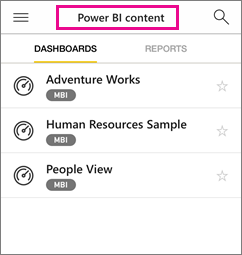
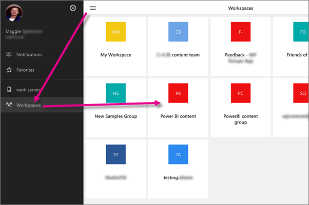
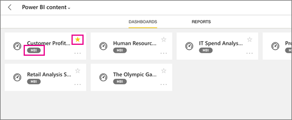

<properties 
   pageTitle="Engage with dashboards in group workspaces in the mobile apps"
   description="Power BI group workspaces are built on Office 365 groups. Read about viewing and interacting with dashboards in the Power BI mobile apps."
   services="powerbi" 
   documentationCenter="" 
   authors="maggiesMSFT" 
   manager="erikre" 
   backup=""
   editor=""
   tags=""
   qualityFocus="no"
   qualityDate=""/>
 
<tags
   ms.service="powerbi"
   ms.devlang="NA"
   ms.topic="article"
   ms.tgt_pltfrm="NA"
   ms.workload="powerbi"
   ms.date="02/06/2017"
   ms.author="maggies"/>

# Engage with dashboards in group workspaces in the mobile apps

Applies to:

|  |  |  |  |  |
|:------------------------|:----------------------------|:----------------------------|:----------------------------------------|:-----------------|
| [iPhones](powerbi-service-mobile-groups-in-the-ipad-app.md#group-workspaces-in-the-iphone-app) | [iPads](powerbi-service-mobile-groups-in-the-ipad-app.md#group-workspaces-in-the-ipad-app) | [Android phones](powerbi-service-mobile-groups-in-the-ipad-app.md#group-workspaces-in-the-android-app) | [Android tablets](powerbi-service-mobile-groups-in-the-ipad-app.md#group-workspaces-in-the-android-app) | [Windows 10 devices](powerbi-service-mobile-groups-in-the-ipad-app.md#group-workspaces-in-the-windows-10-app) |

Power BI group workspaces offer a great space to collaborate with your colleagues. They're built on Office 365 groups.

You [create a group workspace in the Power BI service](powerbi-service-create-a-group-in-power-bi.md). Then you see and interact with the dashboards and reports in that workspace in the Microsoft [Power BI apps for mobile devices](powerbi-power-bi-apps-for-mobile-devices.md). 

Groups are available with the Power BI Pro experience.

## Group workspaces in the iPhone app
1.  Open the Power BI for iOS app for the iPhone. 

    Need to [download and install the iOS app for the iPhone](http://go.microsoft.com/fwlink/?LinkId=522062) first?

2.  Tap the global navigation button , tap Workspaces , and select a group. 
 
    

3.  Your group page displays the dashboards that have been published to the group workspace.  

    

4.  [Select a dashboard](powerbi-mobile-dashboards-in-the-iphone-app.md) to open and view it.

## Group workspaces in the iPad app

1.  Open the Power BI for iOS app for the iPad. 

    Need to [download and install the iOS app](http://go.microsoft.com/fwlink/?LinkId=522062) first?

2.  Tap the global navigation button  in the upper-left corner, then tap Workspaces .

3.  Select a group.

    

4.  Your group workspace displays the dashboards and reports that have been published to that workspace.

    

     -     Yellow stars  show which dashboards are your favorites. 

     -     The notation below each dashboard name  shows how the data in each dashboard is classified. Read more about [data classification in Power BI](powerbi-service-data-classification.md).

5.  [Select a dashboard](powerbi-mobile-dashboards-on-the-ipad-app.md) or [select a report](powerbi-mobile-reports-on-the-ipad-app.md) to open and view it.

## Group workspaces in the Android app 

1.  Open the Android app for Power BI.

    Need to [download the Android app](http://go.microsoft.com/fwlink/?LinkID=544867) first?

2.  Tap the global navigation button , then tap Workspaces .  

    

3.  Select a group workspace.

    

4.  Your group page displays the dashboards and reports that have been published to the group workspace.  

    

4.  [Select a dashboard](powerbi-mobile-dashboards-in-the-android-app.md) to open and view it in the group workspace.  

## Group workspaces in the Windows 10 app

1.  Open the Power BI mobile app for Windows 10.

    Need to [download the app](http://go.microsoft.com/fwlink/?LinkID=526478) first?

2.  Tap the Workspaces icon  on the left, select a group.  

    

3.  Your group page displays the dashboards that have been published to the group workspace.  

    

4.  [Select a dashboard](powerbi-mobile-dashboards-in-the-win10phone-app.md) or a report to open and view it.  

## See also
- [Create a group workspace in the Power BI service](powerbi-service-create-a-group-in-power-bi.md)
