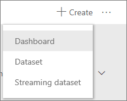
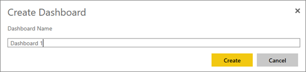
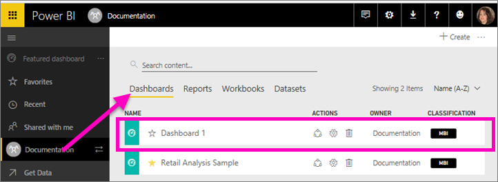

<properties
   pageTitle="Create a Power BI dashboard"
   description="Create a Power BI dashboard"
   services="powerbi"
   documentationCenter=""
   authors="mihart"
   manager="mblythe"
   backup=""
   editor=""
   tags=""
   featuredVideoId=""
   qualityFocus=""
   qualityDate=""/>

<tags
   ms.service="powerbi"
   ms.devlang="NA"
   ms.topic="article"
   ms.tgt_pltfrm="NA"
   ms.workload="powerbi"
   ms.date="11/10/2016"
   ms.author="mihart"/>

# Create a Power BI dashboard

You've read [Dashboards in Power BI](powerbi-service-new-dashboards.md), and now you want to create your own. There are many different ways to create a dashboard.  You could import a dashboard, [have one shared with you](powerbi-service-share-unshare-dashboard.md), [create a new dashboard by pinning visuals and images from a report](powerbi-service-pin-a-tile-to-a-dashboard-from-a-report.md), or create an empty dashboard.

>[AZURE.NOTE] To add content to an empty dashboard, [get some data](powerbi-service-get-data.md) and [pin some tiles](powerbi-service-dashboard-tiles.md).

>[AZURE.NOTE] Dashboards are a feature of Power BI service, not Power BI Desktop.

## Import a dashboard

In this example we'll use one of the [Power BI samples](powerbi-sample-datasets.md) to create a dashboard.

1. [Open a workspace](powerbi-service-workspaces.md).

2. From the leftnav, select **Get Data**.

    

3.  From the bottom left corner, select **Samples**.

    

4.  Select one of the samples and choose **Connect**.

    

5. Power BI adds the dashboard to your active workspace. A yellow asterisk to the right of the dashboard name lets you know that it's new.

    

## Create an empty dashboard from scratch
This method creates a new, empty, dashboard.

1. Open the workspace where you'd like to add the dashboard.

2.  Near the top right corner of the workspace, select **Create** > **Dashboard**.

	

3. Type a name for your new dashboard and select **Create** .

	

4. The new dashboard opens. It's blank since you haven't added any tiles yet.

    

5. Navigate back to active workspace and select the **Dashboards** tab to see your new dashboard listed.

    

## Add some content to the dashboard

There are many different ways to add content to your dashboard.

-  [Connect to or import at least one dataset](powerbi-service-get-data.md) and [pin content from that dataset to your dashboard](powerbi-service-dashboard-tiles.md).

- [Add standalone content to your dashboard](powerbi-service-add-a-widget-to-a-dashboard.md). Use **Add tile** to add an image, text box or heading, video, or web content to your dashboard.

>[AURE.TIP] Need some help getting started adding content?  Check out the [Get started with Power BI tutorial](powerbi-service-get-started.md).

## See also
[Power BI dashboards](powerbi-service-new-dashboards.md)

[Power BI - Basic Concepts](powerbi-service-basic-concepts.md)

More questions? [Try the Power BI Community](http://community.powerbi.com/)
