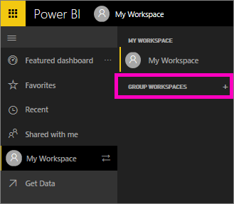
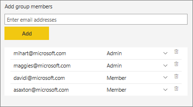

<properties
   pageTitle="Create a group workspace in Power BI "
   description="Read about creating group workspaces in Power BI to bring together people and information, and connect with apps across Office 365, fostering communication and collaboration."
   services="powerbi"
   documentationCenter=""
   authors="ajayan"
   manager="mblythe"
   backup=""
   editor=""
   tags=""
   qualityFocus="monitoring"
   qualityDate="04/27/2016"/>

<tags
   ms.service="powerbi"
   ms.devlang="NA"
   ms.topic="article"
   ms.tgt_pltfrm="NA"
   ms.workload="powerbi"
   ms.date="11/10/2016"
   ms.author="mihart"/>

# Create a group workspace in Power BI

##  About workspaces
Power BI content is made up of dashboards, reports, workbooks, and datasets. And each piece of content is associated with a ***workspace***. **My workspace** is where you create and manage content you own. **Shared with me** is where read-only content that colleagues have shared with you is stored.  **Group workspaces** is where teams collaborate on content.

When you open Power BI for the first time, you'll have one top-level workspace named **My Workspace**. You can [create and add new workspaces](powerbi-service-workspaces.md), and those will be organized as **Group workspaces**.

Need help understanding the building blocks that make up Power BI?  See [Power BI - Basic Concepts](powerbi-service-new-basic-concepts.md).

## Group workspaces
Groups in Power BI bring together people and information, and connect with apps across Office 365 to foster communication and collaboration. Power BI groups are built on [groups in Office 365](https://support.office.com/article/Create-a-group-in-Office-365-7124dc4c-1de9-40d4-b096-e8add19209e9). You can create a group in Power BI, or in Office 365 -- it has the same characteristics either way. 

Group workspaces "hold" content for members of a group. A group can have one or more members. So if the Sales department wants a workspace for all of their dashboards, reports, workbooks, and datasets related to 2016, they can [create a group ](powerbi-service-create-a-group-in-power-bi.md) and name it "Sales 2016". Power BI creates a corresponding empty group workspace also named "Sales 2016". Now the Sales team can add and collaborate on content in that group workspace.

Any [Power BI Pro](powerbi-power-bi-pro-content-what-is-it.md) user can [create a group](powerbi-service-new-create-a-group-in-power-bi.md) and [be a member of a group](powerbi-service-share-unshare-dashboard). And if a colleague creates a group and adds you as a member, Power BI adds that group workspace to your Power BI as well.

As the creator of a group, you are automatically an admin. As admin, you can add and delete members, and make other members admins. All admins can create, update, and delete the dashboards, reports, and other content of the group.

You can invite colleagues from your organization to your Power BI group, even if they aren't in Azure Active Directory.  

There are other ways to share in Power BI. See [How should I share my dashboard?](powerbi-service-how-should-i-share-my-dashboard.md) for more information.

>[AZURE.NOTE]   
> -   Groups are only available with [Power BI Pro](powerbi-power-bi-pro-content-what-is-it.md).
> -  You can't publish reports to the web from a group.

## Create a group and add members

1.  In Power BI service, select the plus sign (+) next to **Group Workspaces**.   

    

2.  In the **Create a Group** pane on the right, fill in a name.  

    

    Power BI suggests a Group ID and lets you know if it's available. If it's not, select the pencil below the **Group ID** box to modify it.  

    >[AZURE.NOTE]  The group ID will be the group's email address:  
    >*yourgroupID*@service.microsoft.com.  
    >If you forget the group ID, you can see it by going to the group's Office 365 Outlook account.

3.  Select a privacy setting:

    **Private:** Only group members can see the group’s contents. People in your organization can request membership in your group. You or another admin can accept or reject their request.

    **Public:** People in your organization can make themselves members of the group, without needing permission from an admin. As soon as they're members, they have the same permissions that other group members have.

    You can't change the Public/Private setting after you've created the group.

4.  Decide whether all members of the group can modify the group's content, or if only the admins can modify the content, and members can only read it. Select either:

    - **Members can edit Power BI content** or

    - **Members can only view Power BI content**

    You can change the edit/view-only setting later, after you've created the group.

5.  Add members by typing in the **Add group member** box, or copying and pasting multiple email addresses from Outlook. Select **Add**. The members are added to the list.

    

    [AZURE.NOTE]
    >
    > - Currently you can't add team or security group distribution lists to groups.
    >  
    > - If some potential members don't already have a Power BI account and aren't in Azure Active Directory, Power BI sends them an email invitation to join Power BI. When they accept, you see them as members of the group.

5.  Select **Admin** or **Member** for each group member.
	Admins can modify content in the group. By default, members can modify the content, unless you changed that in the previous step.

7.  Select **Save**.

Now you have a group where you can store files, and everyone in the group can work on, or at least view, them.

## More about groups in Power BI  

Groups in Power BI bring you and your colleagues together to collaborate, communicate, and connect with your data across Office 365. Create a group in either Power BI or Office 365. Then invite co-workers into this group workspace where you can collaborate on your organization’s shared dashboards, reports, and datasets.  

Groups and [organizational content packs](powerbi-service-organizational-content-packs-introduction.md) complement each other. When you create dashboards, reports, or content packs in the group workspace, you can decide that everyone in that group can edit the group's content, or you can let some members edit, and others just read. See [How should I share my dashboard?](powerbi-service-how-should-i-share-my-dashboard.md) for more about other ways to share.  

Collaboration doesn’t end with Power BI. It continues with other Office 365 group services, like sharing files on OneDrive for Business, conversations in Exchange, calendar, tasks, and so on. [Collaborate with your Power BI group](powerbi-service-collaborate-with-your-power-bi-group.md).

You can also share dashboards, reports, and datasets read-only with people outside your group. The process is the same as [sharing dashboards in your own workspace.](powerbi-service-share-unshare-dashboard.md)

### See also
- [Connect to files on your group's OneDrive for Business](powerbi-service-connect-to-files-on-your-groups-onedrive-for-business.md)  
- [Collaborate with your Power BI group](powerbi-service-collaborate-with-your-power-bi-group.md)  
- [Manage your group](powerbi-service-manage-your-group-in-power-bi-and-office-365.md)
- [How should I share my dashboard?](powerbi-service-how-should-i-share-my-dashboard.md)
- More questions? [Try the Power BI Community](http://community.powerbi.com/)
 
