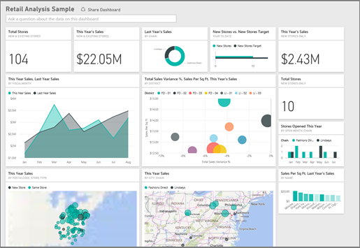

<properties
   pageTitle="Dashboards in Power BI"
   description="Dashboards in Power BI"
   services="powerbi"
   documentationCenter=""
   authors="mihart"
   manager="mblythe"
   backup=""
   editor=""
   tags=""
   qualityFocus="no"
   qualityDate=""/>

<tags
   ms.service="powerbi"
   ms.devlang="NA"
   ms.topic="article"
   ms.tgt_pltfrm="NA"
   ms.workload="powerbi"
   ms.date="11/10/2016"
   ms.author="mihart"/>

# Dashboards in Power BI
## Introduction to dashboards

Dashboards, reports, and datasets are at the heart of Power BI service. Create personalized ***dashboards*** to monitor your most important data, at a glance.  A dashboard combines on-premises and cloud-born data in a single pane of glass, providing a consolidated view across the organization regardless of where the data lives. Each metric, or insight, is displayed on the dashboard as a ***tile***. 

Need help understanding the building blocks that make up Power BI?  See [Power BI - Basic Concepts](powerbi-service-basic-concepts.md).

There are samples available for you to use with Power BI. Below shows the Retail Analysis Sample. For detailed information about the sample, see [Sample datasets](powerbi-sample-datasets.md).

Each tile is a snapshot of information taken from an underlying dataset.  Learn how to [add tiles to a dashboard](powerbi-service-dashboard-tiles.md). The tiles on a dashboard can be [resized, moved, deleted, linked, and renamed](powerbi-service-edit-a-tile-in-a-dashboard.md). 

##  Working with dashboards in Power BI service

You can have more than one dashboard but only one can be open at a time. There are many different ways to open or manage a dashboard:  from a workspace, **Recent**, **Shared with me**, [**Favorites**](powerbi-service-new-favorite-dashboards.md) (open only), and [**Featured dashboard**](powerbi-service-new-featured-dashboards.md) (open only).  

###   Dashboards, workspaces, and "Shared with me"

When you create a new dashboard, its title is added to the current workspace; either **My workspace** or a [group workspace](powerbi-service-workspaces.md). The dashboard is not accessible from any other workspace. When a dashboard is shared with you, its title is added to the **Shared with me** list and, in this case, the dashboard is not available from a workspace.

Say I'm in my ***Sales 2016*** workspace and I create a new dashboard and name it ***Projections***. If I want to open or modify settings for that dashboard, I start in the ***Sales 2016*** workspace and select **Projections**.  

To see the list of dashboards for a given workspace, open the workspace and select the **Dashboards** tab.

To see the list of dashboards that have been shared with you, select **Shared with me**.

From either of these locations, you can open, review, and manage settings for your dashboards.

-  Hover over and select a dashboard to open it.

-  If you own a dashboard, you can review and edit dashboard settings (including renaming)   and you can [share it](powerbi-service-new-share-unshare-dashboard.md)  .

-  Certain types of dashboards can be copied 

-  [Delete a dashboard](powerbi-service-delete.md)  

   Additionally, if your lists of dashboards or recent items get long, [use the search field and sorting to find what you need](powerbi-service-search-filter-sort.md).

   >[AZURE.NOTE] For information about EGRC classifications, select the classification button or [visit Dashboard data classification ](powerbi-service-data-classification.md).

## For more information about dashboards

From the table of contents (on the left side of this browser page), expand **Dashboards** to see all the topics related to Power BI dashboards.

## Next steps

-   [Get data](powerbi-service-get-data.md) and [add tiles](powerbi-service-dashboard-tiles.md) and [images, videos, web code, and text boxes](powerbi-service-add-a-widget-to-a-dashboard.md) to your dashboard from reports, Q&A, SSRS, Excel, and more.

-   Want to make hard copies of your dashboard?  [Print it](powerbi-service-print.md).

-   Display your dashboard without controls and menus using full screen [TV mode](powerbi-service-dash-and-reports-fullscreen.md).

-   Dashboards can be wider and longer than the browser window. If so, they have scroll bars. Because you want to show everything important at a glance, we recommend making the dashboard fit the browser window. For more tips, see [Tips for designing a great dashboard](powerbi-service-tips-for-designing-a-great-dashboard.md).

## See also

[Power BI - Basic Concepts](powerbi-service-basic-concepts.md)

More questions? [Try the Power BI Community](http://community.powerbi.com/)
